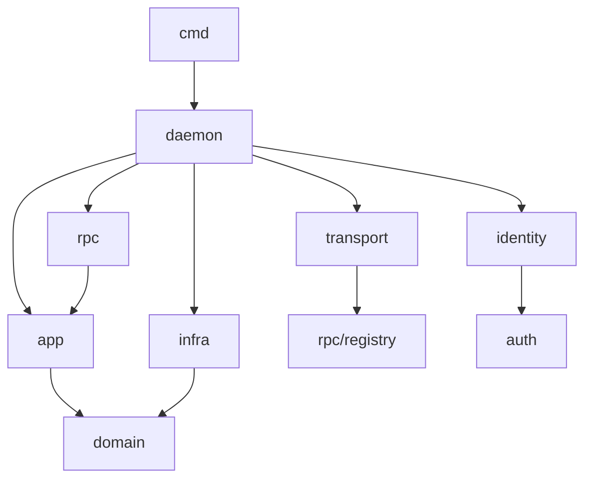
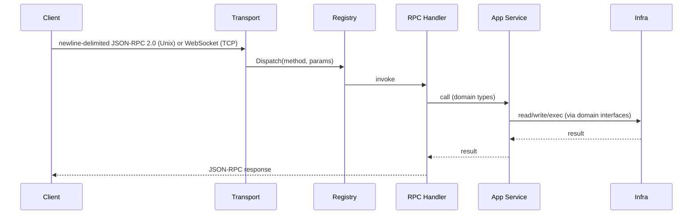

# Nexus Architecture

## Overview

Nexus is a remote workspace system. A Go daemon (`packages/nexus`) runs on a remote Linux host and manages isolated development environments inside libkrun micro-VMs. Users interact with it through a local CLI (`nexus`) or a macOS app (`NexusApp`).

### Binaries

| Binary | Location | Purpose |
|--------|----------|---------|
| `nexus` | `cmd/nexus/` | CLI + daemon in one binary. `nexus daemon start` runs the daemon; all other subcommands are RPC clients. |
| `nexus-guest-agent` | `cmd/nexus-guest-agent/` | In-VM agent running inside every libkrun workspace. Exposes JSON-RPC over vsock for exec, PTY, file I/O, and port-forwarding. |
| `nexus-libkrun-vm` | `cmd/nexus-libkrun-vm/` | Standalone CGO binary spawned per-VM by the daemon. Links `libkrun.so` and becomes the VMM (Virtual Machine Monitor). |
| `schema` | `cmd/schema/` | JSON schema generator for RPC contracts. |

**Entry point:** `cmd/nexus/main.go`  
**Composition root:** `internal/daemon/daemon.go`

---

## Layer Model

The codebase uses four layers inside `internal/`. The dependency rule is simple: **lower layers never import higher layers.**

```
domain/  ←  infra/  ←  app/  ←  rpc/
                              ↑
                           transport/
```



---

### `internal/domain/` — What things ARE

Pure Go. No SQL, no files, no network. Only entities, value types, business rules, repository interfaces, and sentinel errors.

`domain/` has **zero internal imports**.

```go
// What a Workspace IS and what rules govern it
type Workspace struct {
    ID                string
    WorkspaceName     string
    Repo              string
    Ref               string
    State             State  // created | starting | running | paused | stopped | restored | removed
    GuestIP           string // runtime-only, not persisted
    ParentWorkspaceID string // for forks
    LineageRootID     string // root of the fork chain
}

func (w *Workspace) CanStart() bool {
    return w.State == StateCreated || w.State == StateStopped || w.State == StateRestored
}

// How it should be stored — interface only, no SQL here
type Repository interface {
    Get(ctx context.Context, id string) (*Workspace, error)
    Save(ctx context.Context, ws *Workspace) error
    Delete(ctx context.Context, id string) error
    List(ctx context.Context) ([]*Workspace, error)
}
```

**Packages:**
- `domain/workspace` — workspace entity, state machine (`CanTransitionTo`), policy, repository interface
- `domain/project` — project entity, repository interface
- `domain/spotlight` — `Forward` entity (port-forward rules), repository interface
- `domain/runtime` — `Driver` interface for VM/sandbox backends

---

### `internal/infra/` — How things are STORED and ACCESSED

Concrete implementations of domain interfaces. SQL, filesystem I/O, process management, and VM runtime drivers live here.

`infra/` **imports `domain/` only**.

**Persistence:**
- `infra/store/` — SQLite persistence via `modernc.org/sqlite`. Implements `WorkspaceStore`, `ProjectStore`, `ForwardStore`.
- `infra/store/migrations/` — goose migration files.

**Filesystem & Config:**
- `infra/fsworkspace/` — filesystem operations for workspace directories on the daemon host (git clone, file layout).
- `infra/config/` — reads node and workspace `Nexusfile` config from disk.
- `infra/dockercompose/` — discovers published ports from `docker-compose.yml` files.
- `infra/hostpaths/` — XDG base directory helpers (`xdgStateNexus`, `xdgShareNexus`, etc.).

**Runtime Drivers:**
- `infra/runtime/libkrun/` — libkrun microVM adapter; implements `domain/runtime.Driver`. See [VM Architecture](#vm-architecture) for deep dive.
- `infra/runtime/sandbox/` — process-isolation fallback adapter; implements `domain/runtime.Driver`. Used on macOS or when KVM is unavailable.
- `infra/runtime/toolchain/` — guest toolchain readiness probe (verifies `codex`, `opencode`, `claude` presence inside VM via guest agent exec).

**Secrets:**
- `infra/secrets/inject/` — secrets injection into workspace environments.

**CLI-only infra** (used by `cmd/nexus`, never by the daemon):
- `infra/cli/profile/` — daemon connection profiles (host, port, SSH port). Tokens stored separately via `auth/tokenstore`.
- `infra/cli/sshtunnel/` — SSH tunnel manager for remote daemon connections (`ssh -fNL`).
- `infra/cli/daemonclient/` — auto-starts local daemon if not running; healthz polling.
- `infra/cli/mutagenbin/` — **legacy** Mutagen sync binaries (Mutagen was dropped; directory retained for build compatibility).

---

### `internal/app/` — What the system DOES (use cases)

Orchestration layer. App services combine domain rules, infra implementations, and runtime drivers to carry out multi-step workflows.

`app/` **depends on `domain/` interfaces, not concrete infra types.** Infra is injected at construction time via `daemon/daemon.go`.

```go
func (s *Service) Start(ctx context.Context, id string) error {
    ws, _ := s.repo.Get(ctx, id)          // 1. load from DB
    if !ws.CanStart() { return err }       // 2. check domain rule
    ws.State = StateStarting
    s.repo.Save(ctx, ws)                   // 3. persist intent
    s.runtime.Start(ctx, ws)               // 4. start the VM (async)
    // VM transitions to Running asynchronously via runStartAsync
    return nil
}
```

**Packages:**
- `app/workspace/` — workspace lifecycle: create, start, stop, delete, fork, restore, discover-ports.
- `app/spotlight/` — port-forward lifecycle: register, remove, list.
- `app/pty/` — PTY session registry and in-process session management.

---

### `internal/rpc/` — How clients CALL the system

Thin transport adapters. Each handler deserialises JSON-RPC, calls the relevant `app/` service, and serialises the response.

No business logic, no SQL, no filesystem access.

**Packages:**
- `rpc/workspace/` — workspace lifecycle handlers
- `rpc/project/` — project CRUD handlers
- `rpc/spotlight/` — spotlight + `workspace.ports.*` handlers
- `rpc/pty/` — PTY session handlers
- `rpc/daemon/` — `node.info`, `daemon.log.tail`
- `rpc/fs/` — filesystem RPC handlers (`fs.readFile`, `fs.writeFile`, etc.)
- `rpc/auth/` — `authrelay.mint`, `authrelay.revoke`
- `rpc/registry/` — `MapRegistry`, flat `map[string]HandlerFunc` dispatch table
- `rpc/errors/` — JSON-RPC error types

**Active RPC methods (registered in daemon):**

| Namespace | Methods |
|---|---|
| `workspace.*` | `info`, `create`, `list`, `remove`, `stop`, `start`, `restore`, `fork`, `ready`, `discover-ports`, `sshcheck`, `serial-log` |
| `spotlight.*` | `start`, `list`, `stop` |
| `workspace.ports.*` | `list`, `add`, `remove` |
| `pty.*` | `create`, `list`, `resize`, `rename`, `close`, `write`, `reattach` |
| `fs.*` | `readFile`, `writeFile`, `exists`, `readdir`, `mkdir`, `rm`, `stat` |
| `node.*` | `info` |
| `daemon.*` | `log.tail` |
| `project.*` | `list`, `create`, `get`, `remove`, `reconcile` |
| `authrelay.*` | `mint`, `revoke` |

---

### `internal/transport/` — How the socket works

- **`listener.go`** — Unix socket listener serving newline-delimited JSON-RPC 2.0. No authentication; access control is implicit via filesystem permissions on the socket.
- **`network_listener.go`** — HTTP server with WebSocket upgrade for remote clients. Supports TLS modes (`off`, `auto` self-signed, `required`). Authenticates via `Authorization: Bearer <token>` header. Exposes `/healthz` and `/version` HTTP endpoints.
- **Push notifications** — `transport.Notifier` interface injected into RPC context. PTY handlers store the notifier in the session so data/exit events can be pushed to clients.

### `internal/daemon/` — Composition root

`daemon.go` is the only file that constructs concrete types and wires layers together:
1. Opens SQLite DB (`infra/store`)
2. Constructs infra implementations (`WorkspaceStore`, `LibkrunManager`, etc.)
3. Constructs app services, injecting infra
4. Constructs RPC handlers, injecting app services
5. Registers handlers with `rpc/registry`
6. Starts `transport/` listeners

No business logic. Only wiring.

### `internal/identity/` — Authentication principals

`Identity` represents an authenticated caller. `Provider` interface is implemented by `LocalTokenProvider` (daemon secret / JWT validation). The identity system exists but is **not yet wired into the active transport path**; the network listener currently uses `StaticTokenStore` (simple string comparison) rather than the identity provider chain.

### `internal/auth/tokenstore/` — Secure token storage

Cross-platform token storage: macOS Keychain (`/usr/bin/security`), Linux SecretService (D-Bus), or headless file fallback (`~/.config/nexus/daemon-token`).

### `internal/tunnel/` — Daemon-side SSH tunnel manager

Low-level SSH port-forward manager using the host `ssh` binary. Auto-restarts with exponential backoff. Distinct from `infra/cli/sshtunnel/` which is client-side.

### `internal/creds/` — Credential bundling and relay

- `creds/agentprofile/` — agent profile credentials
- `creds/bundle/` — credential bundling for `workspace.create`
- `creds/inject/` — credential injection into guest environments
- `creds/relay/` — auth relay broker for short-lived workspace-scoped tokens

### `internal/build/` and `internal/buildinfo/` — Build metadata

**Note:** These two packages are functionally identical — both hold version/commit/time metadata injected via `-ldflags`. `buildinfo/` is the actively used one; `build/` is legacy.

### `internal/profile/` — Profile management

**Note:** This package duplicates responsibilities with `infra/cli/profile/`. `internal/profile/` stores profiles as a single JSON array (`profiles.json`); `infra/cli/profile/` stores one file per profile and integrates with `tokenstore` for secure token storage. Consolidation is planned.

---

## VM Architecture

### Process Model

The daemon spawns **two child processes per workspace**:

1. **`nexus-libkrun-vm`** — CGO binary that links `libkrun.so` and becomes the VMM. The daemon itself does **not** link `libkrun.so`, keeping the main binary CGO-free.
2. **`passt`** — User-mode network stack providing NAT-like connectivity between host and guest.

```
┌─────────────────────────────────────────────┐
│                nexus daemon                 │
│  (Go, no CGO, JSON-RPC server, SQLite)      │
└──────────────┬──────────────────────────────┘
               │ spawns per workspace
               ▼
┌─────────────────────────────────────────────┐
│          nexus-libkrun-vm                   │
│  (CGO, links libkrun.so, becomes VMM)       │
│  ┌─────────────────────────────────────┐    │
│  │           libkrun guest             │    │
│  │  ┌─────────────────────────────┐    │    │
│  │  │   nexus-guest-agent         │    │    │
│  │  │  (JSON-RPC over vsock)      │    │    │
│  │  └─────────────────────────────┘    │    │
│  └─────────────────────────────────────┘    │
└─────────────────────────────────────────────┘
               │
               ▼
┌─────────────────────────────────────────────┐
│              passt process                  │
│  (user-mode NAT, AF_UNIX socketpair)        │
└─────────────────────────────────────────────┘
```

### Volume Management and Layering

Each workspace gets its own set of disk images. The layout depends on the workspace mode.

**Hybrid mode** (production default):

| Device | Image | Purpose | Mount Point |
|--------|-------|---------|-------------|
| `/dev/vda` | reflink-cloned rootfs | Guest root filesystem `/` | `/` |
| virtiofs `nexus-workspace` | host project directory | Project source (read-only lower) | `/mnt/nexus-lower` |
| `/dev/vdb` | workspace ext4 | Overlay upper layer (writable) | `/mnt/nexus-overlay` |
| `/dev/vdc` | docker-data ext4 | Docker storage | `/var/lib/docker` |
| `/dev/vdd` (optional) | hostconfig ext4 | Config drive (dotfiles, SSH keys, credentials) | `/run/nexus-host` |

The guest agent assembles an **overlayfs** mount at `/workspace`:
```
lowerdir=/mnt/nexus-lower   (virtiofs project source, ro)
upperdir=/mnt/nexus-overlay/upper   (ext4 block device, rw)
workdir=/mnt/nexus-overlay/work
```

This gives the guest a writable `/workspace` while the host project directory remains untouched. All mutations (file edits, build artifacts, `node_modules`) live in the overlay upper layer.

**Block mode** (bake VM only):
No virtiofs share. Used when baking the rootfs because virtiofs ownership restrictions break `apt-get`. The workspace is a plain ext4 block device.

### Rootfs Clone

Each workspace gets its own writable rootfs via a **reflink clone** (`cp --reflink=always`) from the base rootfs image:
- Base rootfs: `~/.local/share/nexus/vm/rootfs.ext4` (installed during bootstrap)
- Per-workspace rootfs: `<workdir>/<workspaceID>/rootfs.ext4`

XFS/btrfs reflink is **required** for O(1) CoW clones. The driver validates reflink support at init time and fails fast if unavailable.

### Base Image → Workspace Image Flow

When a workspace is created, the daemon builds or reuses a **cached base image** for the repo:

1. `EnsureBaseImage(ctx, repoRoot, basesDir, manifestHash)` computes a cache key (SHA256 of `repoRoot + manifestHash + bakeVersion`).
2. If cache miss, `buildBaseImage()` creates a sparse ext4 image sized to `2×projectSize + overhead` (clamped 2–20 GiB) and populates it with `mkfs.ext4 -d <repoRoot>`.
3. The workspace image is then created via `cp --reflink=always` from the cached base image to `<workdir>/<workspaceID>/workspace.ext4`.
4. A fresh 50 GiB sparse ext4 is created for Docker data.

Per-repo `sync.Map` mutexes prevent concurrent base image builds for the same repository.

### Baking Process

`BakeRootfsIfNeeded` pre-installs developer tools into the base rootfs so every workspace clone starts with tools already present.

**Cache invalidation:**
- Host-side stamp: `~/.local/state/nexus/rootfs-baked-v7`
- In-image stamp: `/var/lib/nexus-tools-base-v7`
- If stamps match, bake is skipped.

**Bake VM flow:**
1. Clone base rootfs (reflink).
2. Inject current guest agent binary into the cloned rootfs at `/usr/local/bin/nexus-guest-agent`.
3. Create minimal workspace and docker-data ext4 images.
4. Start `passt` for outbound internet.
5. Spawn `nexus-libkrun-vm` with `nexus.bake=1` in kernel cmdline.
6. Poll hvc0 serial log for `"agent bake: all tools installed"` (up to 90s).
7. After VM halts, run `e2fsck -f -y` on the baked rootfs.
8. Write in-image stamp via `debugfs`.
9. Repair npm symlinks via `debugfs`.
10. Atomically replace the base rootfs.

The guest agent, when it sees `nexus.bake=1`, runs `apt-get install` for base packages, installs npm CLIs (`opencode`, `codex`, `claude`), starts Docker, and then powers off.

### passt Networking

`passt` (Plug A Simple Socket Transport) provides NAT-like connectivity:
- An `AF_UNIX` socketpair is created; the VM side goes to libkrun, the host side goes to passt.
- passt binds to the host loopback and forwards traffic to the guest.
- SSH port-forward: host `127.0.0.1:<random>` → guest `22`.
- MAC address is deterministically derived from `workspaceID` via FNV-1a hash.
- Guest IPv4 is deterministically derived from MAC and host gateway in a `/16` subnet.
- passt **must** use `context.Background()` (not the RPC request context) because it outlives the request.
- If passt dies, the VM is killed because networking is irrecoverable.

### Guest Agent Injection

The guest agent binary is injected into the rootfs in two ways:
1. **Bake-time:** Before starting a bake VM, the daemon injects the current embedded agent into the cloned rootfs via `debugfs write`.
2. **General:** The `injectFileIntoExt4()` helper uses `debugfs -w` to write files into raw ext4 images without mounting them.

The agent binary is embedded into the daemon binary at build time and extracted alongside `libkrun.so` during rootless bootstrap.

---

## Guest Agent (`nexus-guest-agent`)

The guest agent is a **single-file Go binary** (`cmd/nexus-guest-agent/main.go`, ~2,300 lines) that runs inside every libkrun workspace. It communicates with the host daemon over **vsock** (virtio socket) on port `10789`.

### Subsystems

| Subsystem | Purpose |
|-----------|---------|
| **Vsock JSON-RPC server** | Main control plane — accepts exec and interactive shell requests |
| **Spotlight port-forward listener** | Raw TCP proxy over vsock (port `10792`) so the host can reach guest loopback services |
| **SSH-agent proxy** | Unix socket (`/tmp/ssh-agent.sock`) → vsock tunnel to the host's SSH agent (port `10790`) |
| **Workspace mount manager** | Mounts virtiofs+overlayfs or legacy ext4 block device at `/workspace` |
| **Host config drive applier** | Mounts host-provided ext4 config image and copies dotfiles, SSH keys, gitconfig, AI tool credentials |
| **Network bootstrap** | Brings up `eth0` via DHCP (udhcpc/dhcpcd/dhclient) or static IP fallback |
| **Kernel filesystem mount** | Mounts `proc`, `sysfs`, `devtmpfs`, `tmpfs`, cgroup hierarchy, `devpts` (PID 1 only) |
| **Package installer** | Apt-get + npm installs developer toolchain (runs only in bake mode) |
| **Docker daemon launcher** | Starts `dockerd` with overlay2, probes iptables NAT support |
| **SSHD launcher** | Generates host keys and starts OpenSSH server for VS Code / Cursor Remote-SSH (PID 1 only) |

### JSON-RPC Protocol

The agent speaks newline-delimited JSON over vsock. There are no named RPC methods; the agent branches on the `Type` field:

| `Type` | Handler | Description |
|--------|---------|-------------|
| *(empty)* | `handleExec` / `handleExecStreaming` | One-shot or streaming command execution |
| `shell.open` | `handleShellOpen` | Start an interactive PTY shell |
| `shell.write` | `handleShellWrite` | Write data to PTY stdin |
| `shell.resize` | `handleShellResize` | Resize PTY window |
| `shell.close` | `handleShellClose` | Kill shell process |

Responses include `Type: "ack"`, `Type: "chunk"` (streaming output), or `Type: "result"` with `ExitCode`.

### PTY Lifecycle

1. `shell.open` allocates a PTY with `creack/pty`, starts the shell process, and stores the session in a mutex-protected map.
2. A goroutine reads from the PTY master fd and streams chunks to the vsock connection.
3. A goroutine waits for `cmd.Wait()`, sends exit code, and cleans up.
4. `shell.write` writes to the PTY master fd.
5. `shell.resize` calls `pty.Setsize()`.
6. `shell.close` kills the process and removes the session.

### Network Configuration

1. Enables IPv4 forwarding, brings up `lo` and `eth0`.
2. Tries DHCP clients in order: `udhcpc`, `dhcpcd`, `dhclient`.
3. If all DHCP fails, falls back to **static IP** derived from the MAC address in the gateway's `/16` subnet.
4. DNS defaults to `8.8.8.8` and `1.1.1.1` (overridable via `nexus.dns=` kernel cmdline).
5. In TSI mode, appends `options use-vc` to force DNS over TCP.

### Host Config Drive

At boot, the agent mounts `/dev/vdd` (or `NEXUS_CONFIG_DEV`) at `/run/nexus-host` and copies:
- `.gitconfig` → `/root/.gitconfig`
- `.ssh/` files (known_hosts, config, authorized_keys)
- `.resolv.conf` → `/etc/resolv.conf`
- GitHub CLI config (`gh/hosts.yml`)
- AI tool credentials (`opencode/`, `claude/`, `codex/`)
- Sources `.nexus-env` into the agent's environment

---

## Workspace Forking

Forking creates a **new child workspace** from an existing parent. It is a metadata+filesystem operation, not a live VM snapshot.

### Domain Model

```go
type Workspace struct {
    ParentWorkspaceID string // direct parent (empty for root)
    LineageRootID     string // root of the entire chain (self for root)
}
```

### Service-Level Fork (`app/workspace/fork.go`)

1. Validate parent exists and is not removed.
2. Generate child ID and name (`<parent>-fork` default).
3. Copy parent's `AuthBinding`.
4. Set `LineageRootID` to parent's `LineageRootID` (or parent's own ID if parent is root).
5. Persist child record with `StateCreated`.
6. Call `runtime.Driver.Fork(parent, child)`.

### Runtime Driver Fork

**Sandbox driver** (`infra/runtime/sandbox/`):
- Creates a new git worktree at `parentPath-fork-<childID>`.
- Replays parent's uncommitted working-tree changes via `git diff | git apply --3way`.
- Returns the new worktree path as `childRoot`.

**libkrun driver** (`infra/runtime/libkrun/`):
- Stops the parent VM briefly to ensure filesystem consistency (`CheckpointFork`).
- Copies parent's VM disk images (workspace ext4 + docker-data ext4) into `.snapshots/<childID>.*.ext4`.
- Uses **CoW reflink clones** when available (`cp --reflink=always`), falling back to sparse copy.
- Restarts the parent VM afterward.
- Returns empty `childRoot`; child uses the same repo URL as parent.

### Fork vs. Restore

| | Fork | Restore |
|---|---|---|
| Workspace record | **New** child ID | **Same** workspace ID |
| Lineage | Sets `ParentWorkspaceID` | No lineage changes |
| Runtime action | Copies images into **new snapshot set** | Re-points **existing** workspace at saved snapshot |
| Use case | Branch off a new workspace | Resume stopped workspace from last state |

---

## Headless RPC / macOS App Integration

The macOS app (`packages/nexus-swift`) connects to the remote Linux daemon via **JSON-RPC 2.0 over WebSocket**.

### Transport Stack

1. **SSH Tunnel** (`SSHTunnelManager` in Swift):
   - Creates local port forward from `127.0.0.1:<random>` to remote daemon port (default 7777).
   - Fetches remote daemon token by running `ssh <target> nexus daemon token`.
   - Auto-restarts with exponential backoff up to 30s.

2. **WebSocket Client** (`WebSocketDaemonClient`):
   - Connects to `ws://127.0.0.1:<localPort>/` with `Authorization: Bearer <token>`.
   - Uses `URLSessionWebSocketTask`.
   - Connection gating: a `readyTask` blocks callers until the WebSocket handshake completes.
   - Push notifications (`pty.data`, `pty.exit`, `daemon.log`) are routed to subscribed handlers.

3. **Go Daemon** (`internal/transport/network_listener.go`):
   - Upgrades HTTP to WebSocket (Gorilla).
   - Validates `Authorization: Bearer <token>` header via `StaticTokenStore`.
   - Each connection gets a `wsConnNotifier` for push notifications.

### Headless RPC Server (App-Side)

`HeadlessRPCServer.swift` is a **mini HTTP/1.1 server inside the macOS app** for automated E2E testing. It is **not** a daemon feature.

- **Activation**: Only runs if `NEXUS_HEADLESS_RPC=1` env var or `~/.nexus-headless-rpc` sentinel file exists.
- **Listen address**: `127.0.0.1:7778` (loopback-only).
- **Protocol**: Plain HTTP/1.1 (not WebSocket, not JSON-RPC).
- Acts as a local HTTP-to-daemon proxy plus a local terminal registry. All workspace lifecycle calls are forwarded through the app's existing WebSocket connection to the remote daemon.

---

## Auth & Security

### Two Transport Paths, Different Security Models

| Transport | Auth Model |
|---|---|
| **Unix socket** | **No auth.** Any process that can access the socket file can call any RPC. Filesystem ACLs are the only gate. |
| **WebSocket / TCP** | `Authorization: Bearer <token>` header. Static token compared in constant time. Token is auto-generated at daemon start if network is enabled. |

### Identity System (Partially Wired)

- `internal/identity/` defines `Identity`, `Provider`, and `LocalTokenProvider` (secret match + JWT HMAC).
- `internal/auth/tokenstore/` provides cross-platform secure token storage.
- **Caveat:** The identity provider chain is **not yet integrated** into the active transport layer. The network listener uses `StaticTokenStore`, not `LocalTokenProvider`.

### Auth Relay

`rpc/auth/` handles workspace-scoped relay tokens:
- `authrelay.mint` — mints a short-lived token bound to a workspace and auth binding (e.g., `"github"`).
- `authrelay.revoke` — revokes a previously minted token.

---

## Unified Concept Map

```
Question                     Layer          Example
──────────────────────────────────────────────────────────────────
What IS a Workspace?         domain/        workspace.Workspace struct + State enum
What RULES govern it?        domain/        workspace.CanStart(), Policy
Where is it STORED?          infra/         infra/store.WorkspaceStore (SQLite)
What can you DO with it?     app/           app/workspace.Service.Start()
How do you CALL that?        rpc/           rpc/workspace.Handler.HandleStart()
Who wires it all together?   daemon/        daemon.New() constructor
How does it run?             infra/         infra/runtime/libkrun/Manager.Spawn()
What runs inside the VM?     cmd/           nexus-guest-agent (vsock JSON-RPC)
Who becomes the VMM?         cmd/           nexus-libkrun-vm (CGO, libkrun.so)
```

---

## Package Tree

```
internal/
├── app/
│   ├── pty/            PTY session registry and management
│   ├── spotlight/      Port-forward lifecycle
│   └── workspace/      Workspace lifecycle (create/start/stop/fork/delete/restore)
├── auth/
│   └── tokenstore/     Secure token storage (Keychain / SecretService / file)
├── build/              Build metadata (legacy — consolidate into buildinfo)
├── buildinfo/          Build metadata (ldflags injection: version, commit, time)
├── creds/
│   ├── agentprofile/   Agent profile credentials
│   ├── bundle/         Credential bundling for workspace create
│   ├── inject/         Credential injection
│   └── relay/          Auth relay broker
├── daemon/             Composition root — wires all layers
├── domain/
│   ├── project/        Project entity + Repository interface
│   ├── runtime/        Driver interface for VM/sandbox backends
│   ├── spotlight/      Forward entity + Repository interface
│   └── workspace/      Workspace entity + state machine + Repository interface
├── identity/           Authentication principal + local token validation
├── infra/
│   ├── cli/            CLI-only infra (NOT used by daemon)
│   │   ├── daemonclient/  Auto-start local daemon + healthz polling
│   │   ├── mutagenbin/    Legacy Mutagen binaries (retained for build compat)
│   │   ├── profile/       Daemon connection profiles (secure token storage)
│   │   └── sshtunnel/     SSH tunnel manager for remote daemon connections
│   ├── config/         Node and workspace config (disk reads)
│   ├── dockercompose/  Docker Compose port discovery
│   ├── fsworkspace/    Filesystem operations for workspace dirs on daemon host
│   ├── hostpaths/      XDG base directory helpers
│   ├── runtime/
│   │   ├── libkrun/    libkrun microVM adapter (VM lifecycle, baking, images)
│   │   ├── sandbox/    Process-isolation fallback
│   │   └── toolchain/  Guest toolchain readiness probe
│   ├── secrets/
│   │   └── inject/     Secrets injection
│   └── store/          SQLite persistence (WorkspaceStore, ProjectStore, ForwardStore)
│       └── migrations/ Goose migration files
├── profile/            Profile management (legacy — consolidate into infra/cli/profile)
├── rpc/
│   ├── auth/           Auth relay RPC handlers
│   ├── daemon/         Node info / daemon log handlers
│   ├── errors/         RPC error types
│   ├── fs/             Filesystem RPC handlers
│   ├── project/        Project CRUD handlers
│   ├── pty/            PTY handlers
│   ├── registry/       MapRegistry — method dispatch
│   ├── spotlight/      Spotlight handlers
│   └── workspace/      Workspace lifecycle handlers
├── transport/          Unix socket + TCP/WebSocket/TLS listeners + push notifications
└── tunnel/             Daemon-side SSH tunnel manager (raw ssh process)

cmd/
├── nexus/              Main CLI + daemon (Cobra)
│   └── commands/
│       ├── daemon/     Daemon start/stop/status commands
│       ├── debug/      Debug helpers (empty / reserved)
│       ├── libkrunvm/  Hidden libkrun-vm command (superseded by nexus-libkrun-vm)
│       ├── project/    Project CLI commands
│       ├── rpc/        RPC client helpers (MuxConn, EnsureDaemon, Do)
│       ├── spotlight/  Spotlight CLI commands
│       └── workspace/  Workspace CLI commands
├── nexus-guest-agent/  In-VM guest agent (Linux only)
├── nexus-libkrun-vm/   Standalone libkrun VM helper (CGO)
└── schema/             JSON schema generator for RPC contracts
```

---

## Request Flow



---

## Remote-First Design

- **Daemon host paths are not user paths.** User credentials travel via RPC, not via daemon filesystem.
- `nexus create` calls `authbundle.BuildFromHome()` on the **client machine** and sends the bundle as `configBundle` in the `workspace.create` RPC call.
- The daemon never reads the daemon host's `$HOME` for user credentials.
- Client-local state is **never stored in the daemon's DB** — that is client-side cache, not daemon state.

---

## E2E Tests

Tests live in `test/e2e/` with the `//go:build e2e` build tag.

```sh
NEXUS_E2E_BINARY=/tmp/nexus go test -tags e2e ./test/e2e/...
```
