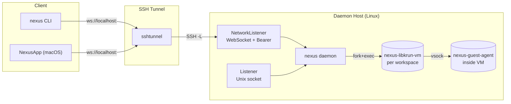
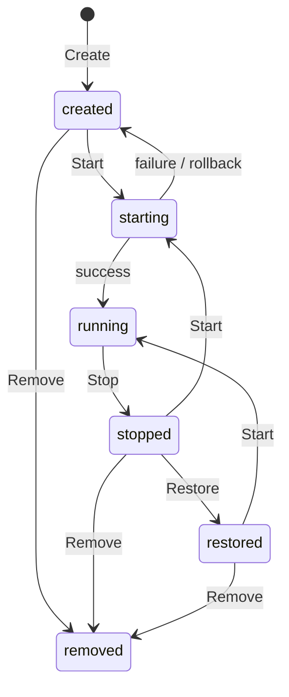
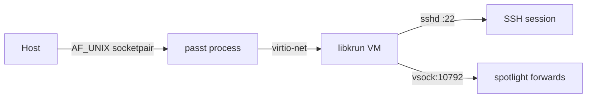
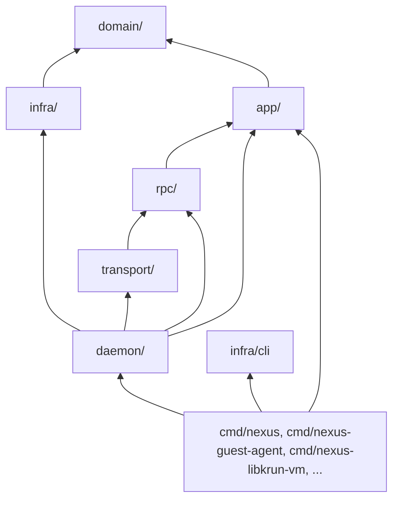
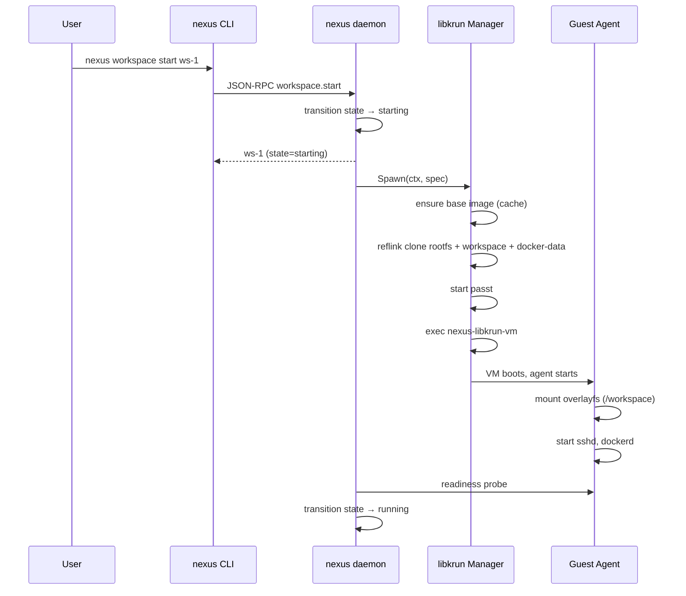

# Nexus Architecture

## Table of Contents

1. [Design Principles](#design-principles)
2. [Bird's Eye View](#birds-eye-view)
3. [Core Concepts](#core-concepts)
4. [Layer Architecture](#layer-architecture)
5. [Key Flows](#key-flows)
6. [Architecture Invariants](#architecture-invariants)
7. [Code Map](#code-map)
8. [Cross-Cutting Concerns](#cross-cutting-concerns)

---

## Design Principles

These principles explain *why* the system is built the way it is. They should change rarely.

- **Hardware isolation per workspace.** Each workspace runs inside its own libkrun micro-VM with a dedicated kernel, memory space, and virtual devices. This provides stronger isolation than containers while keeping startup times competitive.

- **CGO-free daemon.** The main `nexus` daemon is pure Go. `libkrun.so` requires CGO and process takeover (`krun_start_enter` never returns). By spawning `nexus-libkrun-vm` as a separate child process, the daemon avoids linking `libkrun.so` directly and keeps the main binary portable and simple.

- **CoW/reflink is the foundation.** Workspace creation must be O(1). Base images (rootfs, project snapshot) are built once and then reflink-cloned (`cp --reflink=always`) per workspace. On XFS/Btrfs this is nearly instantaneous and shares disk blocks until written.

- **Hybrid disk model: live code + mutable overlay.** The host project directory is exposed to the guest as a read-only virtiofs mount. All mutations (uncommitted changes, installed dependencies, build artifacts) are written to a separate workspace block device that acts as the overlayfs upperdir. This gives the guest a live view of the codebase while keeping mutations isolated, snapshot-able, and discard-able.

- **Deterministic guest networking.** Every workspace gets the same MAC and IPv4 address across restarts because they are derived from the workspace ID via FNV-1a hash. This avoids stale ARP caches, simplifies SSH known_hosts, and makes port forwarding stable.

- **Two transports, two trust models.** Local CLI talks to the daemon over a Unix domain socket with no authentication (filesystem ACL only). Remote clients connect over WebSocket with a static Bearer token. The two paths are kept separate so local tools never need tokens.

---

## Bird's Eye View

Nexus is a remote workspace daemon that runs isolated development environments inside libkrun micro-VMs on a Linux host. Users connect via a local CLI or a macOS app over SSH-tunnelled WebSocket.

The daemon is a long-lived Go process. It listens on both a Unix socket (local CLI) and a TCP port (WebSocket for remote clients). When a user starts a workspace, the daemon spawns a `nexus-libkrun-vm` child process that becomes the VMM. The guest agent inside the VM connects back to the host over vsock to accept exec, PTY, and port-forward commands.

In addition to the core daemon, the repository contains:
- **`packages/nexus-swift`** — The macOS app (`NexusApp.app`), which connects to a remote Linux daemon via SSH tunnel + WebSocket. It does not run a local daemon in production.
- **`cmd/nexus-libkrun-vm`** — VMM child process (libkrun wrapper)
- **`cmd/nexus-guest-agent`** — In-VM agent
- **`cmd/test-libkrun`**, **`cmd/test-runner`**, **`cmd/make-test-bundle`**, **`cmd/schema`** — Test and build utilities

---

## Core Concepts

### Workspace

A workspace is a runnable remote development environment. It has a lifecycle state machine:

**Fork** creates a new workspace (new ID) as a CoW copy of a parent. The parent images are reflink-copied into `.snapshots/<childID>.*.ext4` and the child record points to them. Fork is used to branch a new environment from an existing one.

**Restore** re-points an existing workspace (same ID) to saved snapshot images. It is used to resume from a previously saved state.

### Disk Model & Volumes

Each libkrun VM sees several block devices and one virtiofs share. They are deliberately separated so each can evolve, be snapshotted, or be discarded independently.

| Guest Device | Mount Point | Source | Purpose & Why |
|-------------|-------------|--------|---------------|
| `/dev/vda` | `/` | reflink clone of baked rootfs | Base OS + pre-installed developer toolchains (Docker, Node, global npm packages). Kept separate from the workspace so tool updates can be baked once and shared. |
| `/dev/vdb` | `/workspace` (overlay upper) | reflink clone of per-repo base image | Mutable project-specific state: uncommitted changes, `node_modules`, build artifacts. This is a block device because overlayfs requires a native kernel filesystem for its upperdir. |
| virtiofs "nexus-workspace" | `/workspace` (overlay lower) | host project directory | Live read-only view of the repo on the host. Developers see file changes on the host instantly without syncing. |
| `/dev/vdc` | `/var/lib/docker` | sparse ext4 | Docker daemon data-root. Docker's overlay2 storage driver requires a native kernel filesystem and cannot run on virtiofs. Isolated per workspace so containers/images don't leak across users. |
| `/dev/vdd` | `/run/nexus-host` | read-only ext4 (optional) | Injected dotfiles, SSH keys, agent profiles, and credentials. Mounted read-only so the guest can read secrets but not mutate the injection volume. |

**Why overlayfs?** The guest needs to see the host project directory (live, read-only) and be able to write files (build artifacts, installed packages) without polluting the host. Overlayfs merges the virtiofs lowerdir (host project) with the block-device upperdir (workspace.ext4) into a single `/workspace` view. The upperdir can be snapshotted, forked, or discarded independently.

**Base image caching.** The first time a project is used, the daemon runs `mkfs.ext4 -d <repoRoot>` to create a cached base image. All subsequent workspaces for that project reflink-clone this base in O(1) time.

### Networking Model

The VM gets network access via **passt** (Plug A Simple Socket Transport) paired with **virtio-net**:

- **passt** runs as a separate child process per VM. It creates a user-space network stack and forwards TCP/UDP between the host and guest without requiring root privileges or bridge interfaces.
- **Deterministic addressing:** The guest MAC and IPv4 are derived from the workspace ID via FNV-1a. The IPv4 lives in the host gateway's `/16` subnet. This means a workspace always gets the same IP across restarts.
- **SSH access:** passt forwards a random host loopback port to guest port 22. The CLI uses this for `ProxyJump` SSH tunnels.
- **Spotlight forwards:** The guest agent listens on vsock port 10792. The host daemon dials this port to set up port-forwarding from the host into the VM (e.g., for web services running inside the workspace).

---

## Layer Architecture

Dependency rule: **lower layers never import higher layers.**

| Layer | Responsibility | Import Rule |
|-------|----------------|-------------|
| `domain/` | Entities, state machines, repository interfaces, sentinel errors. This is the core vocabulary of the system. | Zero internal imports |
| `infra/` | Repository implementations (SQLite, filesystem), VM runtime drivers (libkrun, sandbox), config parsing. | `domain/` only |
| `app/` | Use-case orchestration: multi-step workflows like start, stop, fork, restore. | `domain/` interfaces only |
| `rpc/` | Transport adapters: JSON-RPC deserialization/serialization, handler wiring. | `app/` via narrow interfaces |
| `transport/` | Socket listeners (Unix, TCP, WebSocket), push notifications. | `rpc/registry` only |
| `daemon/` | Composition root: constructs and wires all layers together. | All layers |

**Why this layering?** The domain layer is kept pure so business rules (state transitions, invariants) can be tested without IO. The app layer orchestrates without knowing whether the workspace runs in a VM or a process. The RPC and transport layers are swappable adapters.

---

## Key Flows

### Starting a Workspace (High-Level)

The start is asynchronous. The RPC returns immediately with `state=starting` and the client polls `workspace.info` until `state=running`.

### Baking the Rootfs

Baking is the process of pre-installing developer tools into the base rootfs image so that every workspace starts with them already present.

1. The daemon checks a bake stamp (e.g. `~/.local/state/nexus/rootfs-baked-v7`).
2. If missing, it reflink-clones the rootfs, injects the guest agent via debugfs, and spawns a temporary VM in "bake mode."
3. The guest agent runs `apt-get install docker nodejs ...` and `npm install -g opencode codex claude`, then powers off.
4. The host validates the baked image with `e2fsck`, atomically replaces the base rootfs, and writes the stamp.

**Why bake?** Installing toolchains takes minutes and requires network access. Baking moves this cost from every workspace start to a one-time daemon bootstrap step.

### Fork vs Restore

| Aspect | Fork | Restore |
|---|---|---|
| Workspace ID | **New** child ID | **Same** workspace ID |
| Lineage | Sets `ParentWorkspaceID` | No change |
| Images | CoW reflink copy to `.snapshots/<child>.*.ext4` | Re-uses existing snapshot |
| Use case | Branch a new environment | Resume from saved state |

---

## Architecture Invariants

These invariants are deliberately enforced by the code structure. They are often expressed as an *absence* of dependencies.

- **The daemon never links `libkrun.so` directly.** All libkrun interaction happens inside the `nexus-libkrun-vm` child process.
- **`infra/` never imports `app/` or `rpc/`.** Infrastructure concerns (databases, VM runtimes) must not depend on use-case orchestration or transport adapters.
- **`domain/` has zero internal imports.** The core entities and state machines are completely self-contained.
- **Guest networking is deterministic.** MAC and IPv4 for a workspace are always derived from the workspace ID. There is no dynamic allocation.
- **Workspace images are immutable after creation.** A workspace image is always a CoW clone; mutations happen inside the VM on the cloned copy. The base cache is never modified in-place.
- **The Unix socket transport has no authentication.** Any process with filesystem access to `nexusd.sock` can invoke any RPC. Network transport requires Bearer token auth.

---

## Code Map

This is a *conceptual* map, not a file listing. Use symbol search (`grep`, `rg`) to find the exact files for each name.

### Workspace Lifecycle

| Concept | Responsibility | Starting Points |
|---------|---------------|-----------------|
| Workspace entity | State machine, validation rules, transitions | `domain/workspace.Workspace`, `domain/workspace.State` |
| Workspace service | Orchestrates create, start, stop, fork, restore, remove | `app/workspace.Service` |
| Workspace store | SQLite persistence for workspace records | `infra/store.WorkspaceStore` |

### Runtime Backends

| Concept | Responsibility | Starting Points |
|---------|---------------|-----------------|
| libkrun driver | VM lifecycle, baking, image management, networking | `infra/runtime/libkrun.Manager`, `infra/runtime/libkrun.VMSpec` |
| Sandbox driver | Process-isolation fallback backend (non-VM) | `infra/runtime/sandbox.Driver` |
| Runtime registry | Selects the correct backend for a workspace | `domain/runtime.Registry` |
| VM abstraction | VM-agnostic runtime spec and execution | `internal/vm/` |
| Tunnel manager | SSH tunnel lifecycle for remote daemon access | `internal/tunnel/` |

### In-VM Services

| Concept | Responsibility | Starting Points |
|---------|---------------|-----------------|
| Guest agent | In-VM agent: exec, PTY, port-forwards, mounts, sshd/dockerd startup | `cmd/nexus-guest-agent` |
| PTY sessions | In-process shell registry and management | `app/pty.Registry`, `app/pty.Session` |
| Spotlight | Port-forward lifecycle orchestration (host → VM) | `app/spotlight.Service` |
| Bundle export/import | Workspace export to `.nxbundle` (OCI-style layers) and import | `domain/bundle.Exporter`, `domain/bundle.Importer` |

### Transport & Auth

| Concept | Responsibility | Starting Points |
|---------|---------------|-----------------|
| Unix listener | Local CLI access, no auth | `transport.Listener` |
| Network listener | Remote WebSocket access, Bearer token | `transport.NetworkListener` |
| Token store | Secure daemon token storage on client (Keychain, SecretService, file) | `auth/tokenstore.Store` |
| Auth relay | Short-lived workspace token broker | `creds/relay.Broker` |

### CLI Client

| Concept | Responsibility | Starting Points |
|---------|---------------|-----------------|
| Daemon client | Auto-start local daemon, health polling | `infra/cli/daemonclient` |
| SSH tunnel | Client-side SSH tunnel manager | `infra/cli/sshtunnel` |
| Connection profile | Daemon connection profiles, token storage integration | `infra/cli/profile` |
| Mutagen binary | Mutagen sync binary management | `infra/cli/mutagenbin` |

---

## Cross-Cutting Concerns

### Auth & Security

| Transport | Authentication | Notes |
|---|---|---|
| Unix socket | **None** | Filesystem ACL only |
| WebSocket / TCP | Static Bearer token | Auto-generated at daemon start; compared via `subtle.ConstantTimeCompare` |

**Caveat:** `internal/identity/` and `LocalTokenProvider` (JWT validation) exist but are **not yet wired** into the active transport path.

Client-side tokens are stored in the OS credential store when available (macOS Keychain, Linux SecretService), falling back to `~/.config/nexus/daemon-token`.

### Secrets Injection

User credentials, dotfiles, and agent profiles are bundled at workspace creation time and injected into the VM via the `hostconfig.ext4` drive. The guest agent mounts this read-only and applies the contents to the guest filesystem at boot.

### Observability

- The daemon logs all RPC method calls and their duration.
- Each VM writes a serial log (`libkrun.log`) and passt writes its own log (`passt.log`) in the workspace workdir.
- The guest agent can be instructed to tail logs back to the client via RPC.
