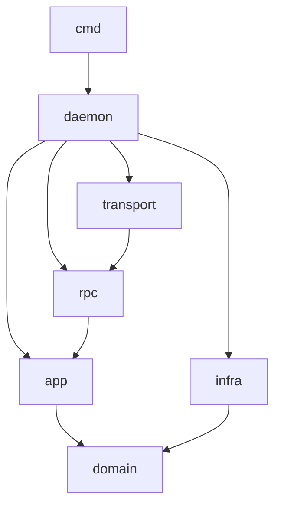
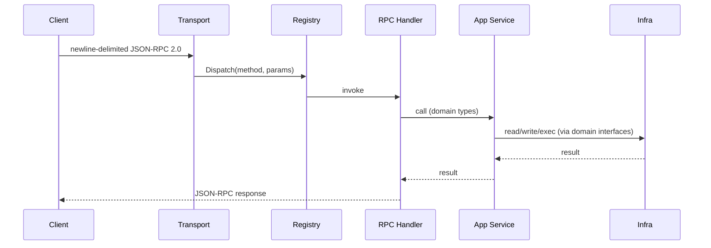

# Nexus Daemon Architecture

## Overview

The Nexus daemon (`packages/nexus/`) is a Go service (`github.com/inizio/nexus/packages/nexus`) that manages remote workspaces using Firecracker VMs. It exposes JSON-RPC 2.0 over a Unix socket and is designed to run on a remote host separate from the CLI client.

Entry point: `cmd/nexusd/main.go`  
Composition root: `internal/daemon/daemon.go` — wires all layers together.

---

## Layer Model

The codebase uses four layers inside `internal/`. Each layer has a single, non-overlapping responsibility. The rule is simple: **lower layers never import higher layers.**

```
domain/  ←  infra/  ←  app/  ←  rpc/
                              ↑
                           transport/
```



---

### `internal/domain/` — What things ARE

Pure Go. No SQL, no files, no network. Only:

- **Entity structs** — `Workspace`, `Project`, `Forward`
- **Value types and enums** — `WorkspaceState`, `RuntimeKind`, etc.
- **Business rules** — state transition guards (`CanStart`, `CanStop`), policy checks
- **Repository interfaces** — contracts for persistence, owned here, implemented in `infra/`
- **Errors** — domain-level sentinel errors

`domain/` has **zero internal imports**. It is the stable foundation everything else builds on.

```go
// What a Workspace IS and what rules govern it
type Workspace struct {
    ID    string
    Name  string
    State State  // Stopped | Starting | Running | Stopping | Error
}

func (w *Workspace) CanStart() bool { return w.State == Stopped }

// How it should be stored — interface only, no SQL here
type Repository interface {
    Get(ctx context.Context, id string) (*Workspace, error)
    Save(ctx context.Context, ws *Workspace) error
    Delete(ctx context.Context, id string) error
    List(ctx context.Context) ([]*Workspace, error)
}
```

**Packages:**
- `domain/workspace` — workspace entity, state machine, policy, repository interface
- `domain/project` — project entity, repository interface
- `domain/spotlight` — Forward entity (port-forward rules), repository interface
- `domain/runtime` — `Driver` interface for VM/sandbox backends

---

### `internal/infra/` — How things are STORED and ACCESSED

Concrete implementations of domain interfaces. This is where SQL, filesystem I/O, and process management live.

`infra/` **imports `domain/` only**. It satisfies domain-defined interfaces and returns domain types.

```go
// How a Workspace is actually stored in SQLite
type WorkspaceStore struct{ db *sql.DB }

func (s *WorkspaceStore) Get(ctx context.Context, id string) (*workspace.Workspace, error) {
    // real SQL query — implements domain/workspace.Repository
}
```

**Packages:**
- `infra/store/` — SQLite persistence; implements all three domain repository interfaces (`WorkspaceStore`, `ProjectStore`, `ForwardStore`)
- `infra/fsworkspace/` — filesystem operations for workspace directories on the daemon host (git, file layout); this is I/O, not a domain entity
- `infra/config/` — reads node and workspace config from disk
- `infra/runtime/firecracker/` — Firecracker VM adapter; implements `domain/runtime.Driver`
- `infra/runtime/sandbox/` — process-isolation fallback adapter; implements `domain/runtime.Driver`
- `infra/secrets/inject/` — secrets injection into workspace environments

**CLI-only infra** (used by `cmd/nexus`, never by the daemon):
- `infra/cli/compose/` — discovers Docker Compose projects on the *client* machine
- `infra/cli/profile/` — daemon profile store (host, port, token, SSH port)
- `infra/cli/sshtunnel/` — SSH tunnel manager for remote daemon connections

---

### `internal/app/` — What the system DOES (use cases)

Orchestration layer. App services combine domain rules, infra implementations, and runtime drivers to carry out actual behaviors. This is where multi-step workflows live.

`app/` **depends on `domain/` interfaces, not concrete infra types.** Infra is injected at construction time via `daemon/daemon.go`.

```go
// What you can DO with a Workspace
type Service struct {
    repo    workspace.Repository  // injected: infra/store.WorkspaceStore
    runtime domain.Driver         // injected: infra/runtime/firecracker.Manager
    fs      *fsworkspace.Manager  // injected: infra/fsworkspace
}

func (s *Service) Start(ctx context.Context, id string) error {
    ws, _ := s.repo.Get(ctx, id)    // 1. load from DB
    if !ws.CanStart() { return err } // 2. check domain rule
    ws.State = Starting
    s.repo.Save(ctx, ws)            // 3. persist intent
    s.runtime.Start(ctx, ws)        // 4. start the VM
    ws.State = Running
    s.repo.Save(ctx, ws)            // 5. persist result
    return nil
}
```

`app/` never writes SQL directly. It only calls interfaces.

**Packages:**
- `app/workspace/` — workspace lifecycle: create, start, stop, delete, fork
- `app/spotlight/` — port-forward lifecycle: register, remove, list
- `app/pty/` — PTY session management: open, resize, close

---

### `internal/rpc/` — How clients CALL the system

Thin transport adapters. Each handler:
1. Deserialises the incoming JSON-RPC request
2. Calls the relevant `app/` service
3. Serialises and returns the response

No business logic here. No SQL. No filesystem access. Just translation.

```go
func (h *Handler) HandleCreate(ctx context.Context, req Request) (Response, error) {
    spec := parseCreateRequest(req)           // 1. deserialise
    ws, err := h.service.Create(ctx, spec)    // 2. delegate to app/workspace
    return marshalWorkspace(ws), err          // 3. serialise
}
```

**Packages:** `rpc/workspace/`, `rpc/project/`, `rpc/spotlight/`, `rpc/pty/`, `rpc/daemon/`, `rpc/fs/`, `rpc/auth/`, `rpc/registry/`

---

### `internal/transport/` — How the socket works

Unix socket listener + newline-delimited JSON-RPC 2.0 framing. Also supports TCP/WebSocket/TLS for remote clients tunnelled over SSH. Dispatches to `rpc/registry/`.

### `internal/daemon/` — Composition root

`daemon.go` is the only place that constructs concrete types and wires layers together. It:
1. Opens the SQLite DB (`infra/store`)
2. Constructs infra implementations (`WorkspaceStore`, `FirecrackerManager`, etc.)
3. Constructs app services, injecting infra implementations
4. Constructs RPC handlers, injecting app services
5. Registers handlers with `rpc/registry`
6. Starts `transport/`

No business logic in `daemon.go`. Only wiring.

---

## Unified Concept Map

```
Question                     Layer          Example
──────────────────────────────────────────────────────────────────
What IS a Workspace?         domain/        workspace.Workspace struct + State enum
What RULES govern it?        domain/        workspace.CanStart(), Policy
Where is it STORED?          infra/         infra/store.WorkspaceStore (SQLite)
What can you DO with it?     app/           app/workspace.Service.Start()
How do you CALL that?        rpc/           rpc/workspace.Handler.HandleStart()
Who wires it all together?   daemon/        daemon.New() constructor
```

---

## Package Tree

```
internal/
├── app/
│   ├── pty/            PTY session management
│   ├── spotlight/      Port-forward lifecycle
│   └── workspace/      Workspace lifecycle (create/start/stop/fork/delete)
├── auth/
│   └── tokenstore/     Token validation
├── creds/
│   ├── agentprofile/   Agent profile credentials
│   ├── bundle/         Credential bundling
│   ├── inject/         Credential injection
│   └── relay/          Auth relay broker
├── daemon/             Composition root — wires all layers
├── domain/
│   ├── project/        Project entity + Repository interface
│   ├── runtime/        Driver interface for VM/sandbox backends
│   ├── spotlight/      Forward entity + Repository interface
│   └── workspace/      Workspace entity + state machine + Repository interface
├── identity/           Identity management
├── infra/
│   ├── cli/            CLI-only infra (NOT used by daemon)
│   │   ├── compose/    Docker Compose project discovery (client machine)
│   │   ├── profile/    Daemon profile store (host, port, token, SSH port)
│   │   └── sshtunnel/  SSH tunnel manager for remote daemon connections
│   ├── config/         Node and workspace config (disk reads)
│   ├── fsworkspace/    Filesystem operations for workspace dirs on daemon host
│   ├── runtime/
│   │   ├── firecracker/ Firecracker VM adapter
│   │   └── sandbox/    Process-isolation fallback
│   ├── secrets/
│   │   └── inject/     Secrets injection
│   └── store/          SQLite persistence (WorkspaceStore, ProjectStore, ForwardStore)
├── profile/            Profile management
├── rpc/
│   ├── auth/           Auth RPC handlers
│   ├── daemon/         Node info / daemon status handlers
│   ├── errors/         RPC error types
│   ├── fs/             Filesystem handlers
│   ├── project/        Project CRUD handlers
│   ├── pty/            PTY handlers
│   ├── registry/       MapRegistry — method dispatch
│   ├── spotlight/      Spotlight handlers
│   └── workspace/      Workspace lifecycle handlers
├── transport/          Unix socket + TCP/WebSocket/TLS listeners
└── tunnel/             SSH tunnel manager
```

---

## Request Flow



---

## Remote-First Design

The daemon runs on a different machine than the user:

- **Daemon host paths are not user paths.** User credentials travel via RPC, not via daemon filesystem.
- `nexus create` calls `authbundle.BuildFromHome()` on the **client machine** and sends the bundle as `configBundle` in the `workspace.create` RPC call.
- The daemon never reads the daemon host's `$HOME` for user credentials.
- Client-local state (local worktree path, Mutagen session IDs) is **never stored in the daemon's DB** — that is client-side cache, not daemon state.

---

## VM Backend

**Firecracker only.** Lima has been removed. `internal/infra/runtime/sandbox/` provides a process-isolation fallback for environments where Firecracker is unavailable.

---

## E2E Tests

Tests live in `test/e2e/` with the `//go:build e2e` build tag.

```sh
NEXUS_E2E_BINARY=/tmp/nexusd go test -tags e2e ./test/e2e/...
```
