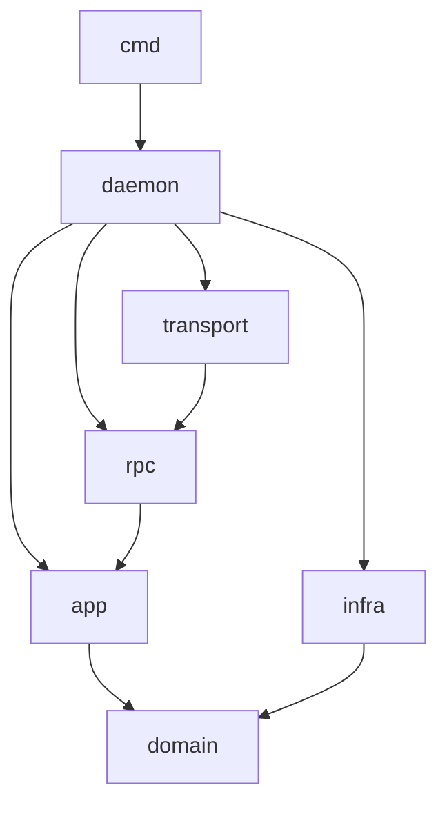
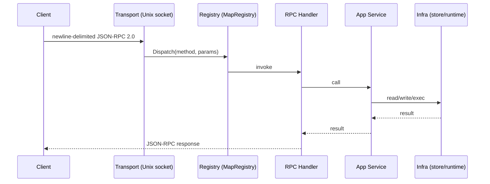

# Nexus Daemon Architecture

## Overview

The Nexus daemon (`packages/nexus/`) is a Go service (`github.com/inizio/nexus/packages/nexus`) that manages remote workspaces using Firecracker VMs. It exposes JSON-RPC 2.0 over a Unix socket and is designed to run on a remote host separate from the CLI client.

Entry point: `cmd/nexusd/main.go`  
Composition root: `internal/daemon/daemon.go` — wires all layers together.

## Layer Structure

```
cmd/nexusd/          entry point, flag parsing
internal/
  daemon/            composition root — wires all layers
  domain/            pure domain types (no project-specific dependencies)
  app/               application services
  infra/             infrastructure implementations
  rpc/               RPC handlers and registry
  transport/         Unix socket listener, newline-delimited JSON-RPC 2.0
  creds/relay/       auth relay broker
test/e2e/            end-to-end tests (build tag: e2e)
```

## Dependency Direction



Rules:
- `domain/` — no project-specific dependencies
- `app/` — may depend on `domain/`
- `infra/` — implements interfaces owned by `domain/` and `app/`
- `transport/` and `rpc/` — may depend on `app/` and `domain/`
- `tests/` — may depend on any layer

## Layer Details

### `internal/domain/`
Pure domain types with no internal dependencies:
- `workspace` — workspace entity, status, lifecycle types
- `project` — project entity
- `spotlight` — spotlight server types
- Runtime driver interface (`Driver`)

### `internal/app/`
Application services that orchestrate domain logic:
- `workspace` — workspace lifecycle service
- `spotlight` — spotlight server management service
- `pty` — PTY session management service

### `internal/infra/`
Infrastructure implementations:
- `store/` — SQLite persistence via `store.DB`
- `runtime/firecracker/` — Firecracker VM adapter
- `runtime/sandbox/` — process-isolation fallback adapter (used where VMs are unavailable)

### `internal/rpc/`
RPC handlers grouped by domain:
- `workspace/` — workspace lifecycle handlers
- `daemon/` — node info and daemon status handlers
- `project/` — project CRUD handlers
- `fs/` — filesystem handlers
- `pty/` — PTY handlers
- `spotlight/` — spotlight handlers
- `auth/` — auth handlers

#### `internal/rpc/registry/`
`MapRegistry` — maps method name strings to handler functions and dispatches incoming requests.

### `internal/transport/`
Unix socket listener. Protocol: newline-delimited JSON-RPC 2.0.

### `internal/creds/relay/`
Auth relay broker — mints and consumes auth grants for injecting credentials into workspace exec environments.

## Request Flow



## VM Backend

**Firecracker only.** Lima has been removed. The `process` sandbox driver in `internal/infra/runtime/sandbox/` provides process-isolation fallback for environments where Firecracker VMs are unavailable.

## Remote-First Design

The daemon may run on a different machine than the user:

- Daemon host paths are not user paths. User credentials must travel via RPC.
- `nexus create` calls `authbundle.BuildFromHome()` on the **client machine** and sends the result as `configBundle` in the `workspace.create` RPC call.
- The daemon never reads the daemon host's `$HOME` for user credentials.
- Seatbelt delivers the bundle via a host-side temp file and unpacks it in the guest; it does not create live symlinks back to the daemon's filesystem.

## E2E Tests

Tests live in `test/e2e/` with the `//go:build e2e` build tag.

```sh
NEXUS_E2E_BINARY=/tmp/nexusd go test -tags e2e ./test/e2e/...
```
