# Nexus Architecture

## Table of Contents

1. [System Overview](#system-overview)
2. [Components](#components)
3. [Request Flow](#request-flow)
4. [Layer Architecture](#layer-architecture)
5. [VM Architecture](#vm-architecture)
6. [Workspace Lifecycle](#workspace-lifecycle)
7. [Auth & Security](#auth--security)
8. [Package Index](#package-index)

---

## System Overview

Nexus is a remote workspace daemon that runs isolated development environments inside libkrun micro-VMs on a Linux host. Users connect via a local CLI or a macOS app over SSH-tunnelled WebSocket.

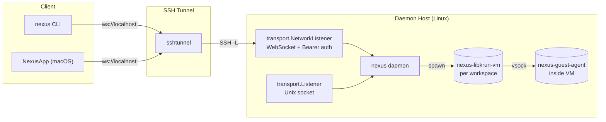

---

## Components

### Binaries

| Binary | Source | Role |
|--------|--------|------|
| `nexus` | `cmd/nexus/` | CLI + daemon. `daemon start` runs the server; all other subcommands are RPC clients. |
| `nexus-guest-agent` | `cmd/nexus-guest-agent/` | In-VM agent. JSON-RPC over vsock for exec, PTY, port-forwarding, mounts. |
| `nexus-libkrun-vm` | `cmd/nexus-libkrun-vm/` | CGO VMM wrapper. Spawned per workspace; links `libkrun.so` and becomes the VM monitor. |
| `schema` | `cmd/schema/` | JSON schema generator for RPC contracts. |

### Why the VMM is a separate binary

The main daemon is CGO-free. `libkrun.so` requires CGO and takeover semantics (`krun_start_enter` never returns). By spawning `nexus-libkrun-vm` as a child process, the daemon avoids linking `libkrun.so` directly.

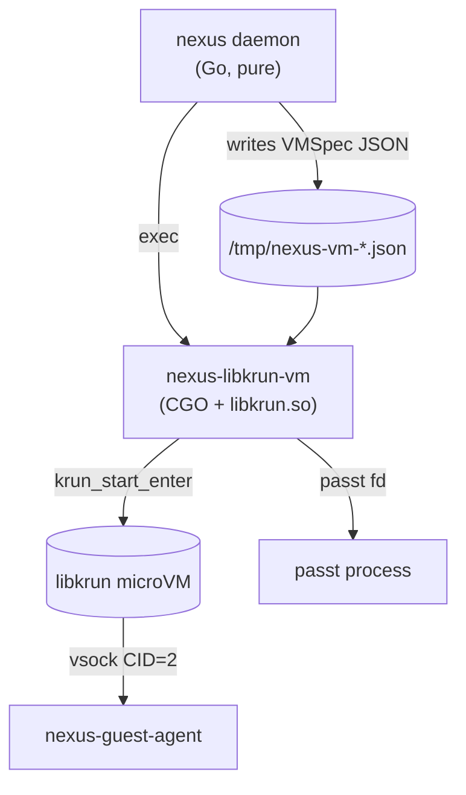

---

## Request Flow

### CLI / App to Daemon

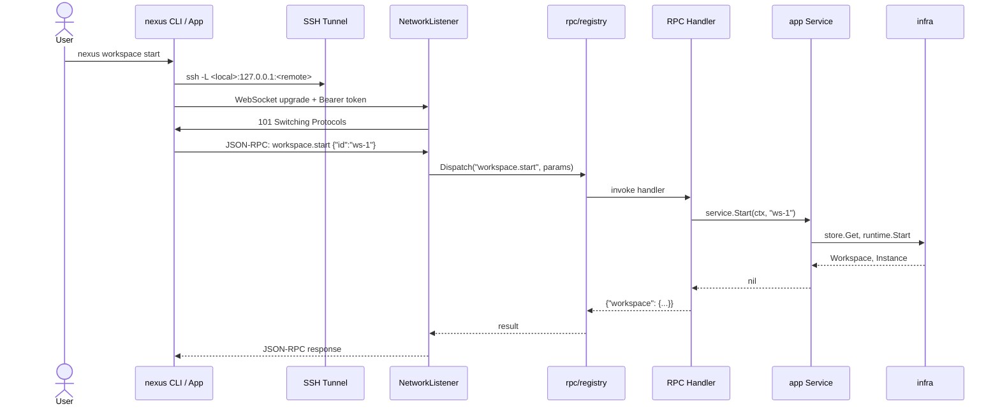

### Daemon to Guest Agent (VM Session)

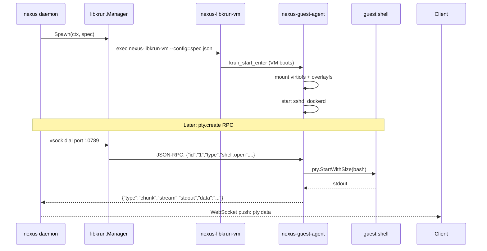

---

## Layer Architecture

Dependency rule: **lower layers never import higher layers.**

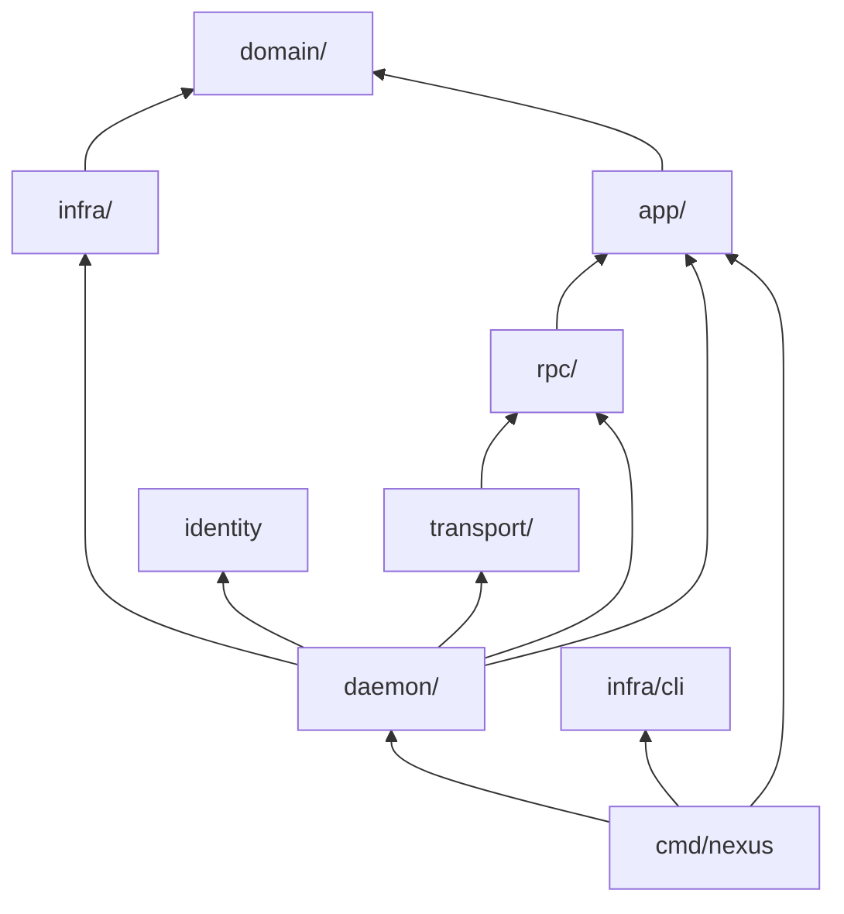

### Layer Responsibilities

| Layer | Responsibility | Import Rule |
|-------|----------------|-------------|
| `domain/` | Entities, state machines, repository interfaces, sentinel errors | Zero internal imports |
| `infra/` | Repository implementations, DB, filesystem, VM runtime drivers | `domain/` only |
| `app/` | Use-case orchestration; multi-step workflows | `domain/` interfaces only |
| `rpc/` | Transport adapters; JSON-RPC deserialization/serialization | `app/` via narrow interfaces |
| `transport/` | Socket listeners, WebSocket upgrade, push notifications | `rpc/registry` only |
| `daemon/` | Composition root; constructs and wires all layers | All layers |

---

## VM Architecture

### Per-Workspace Process Tree

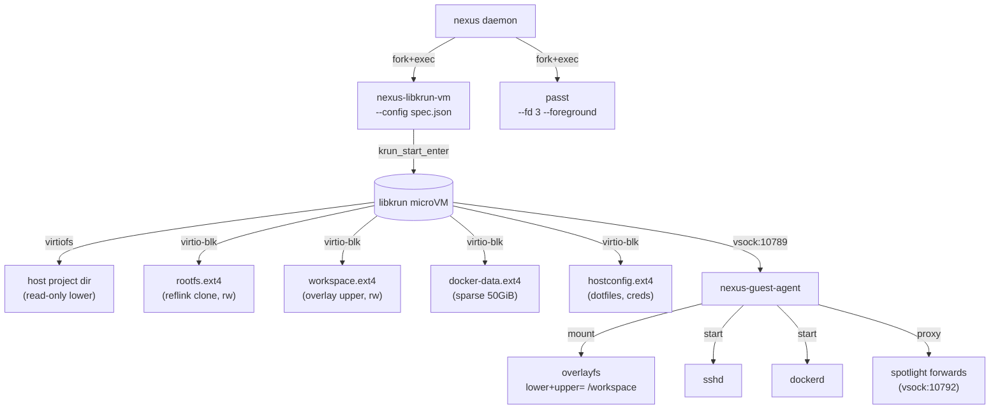

### Disk Layout (Hybrid Mode)

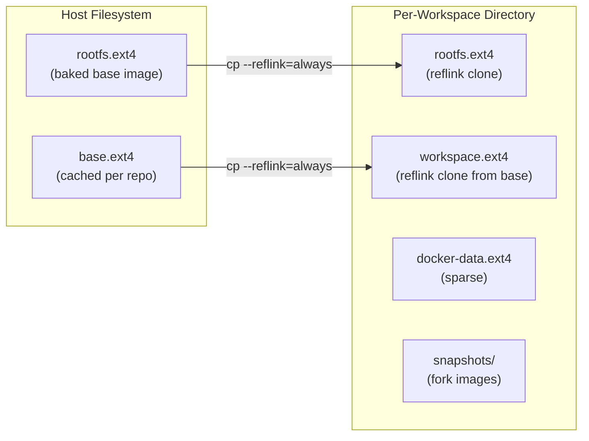

### Overlayfs Assembly Inside the Guest

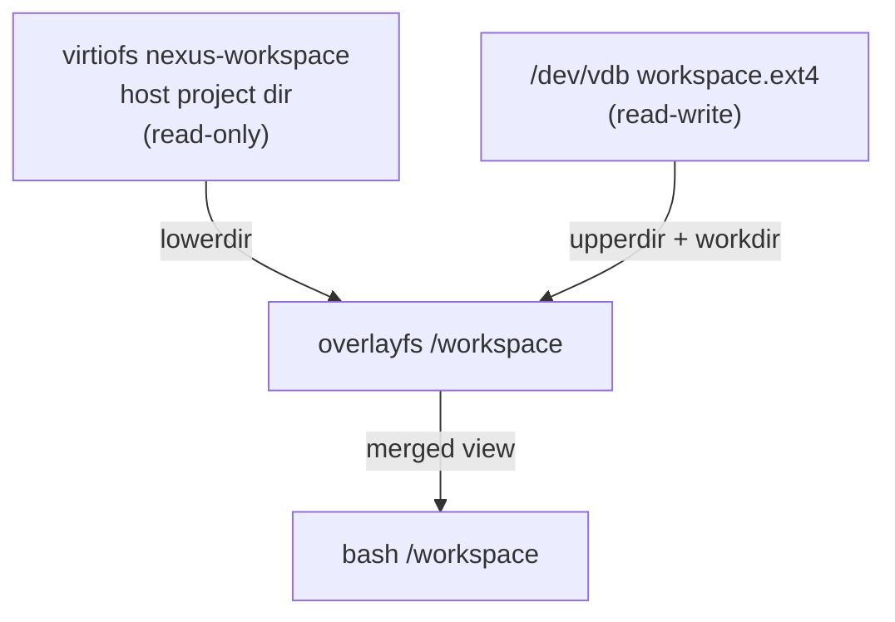

### Base Image → Workspace Image Flow

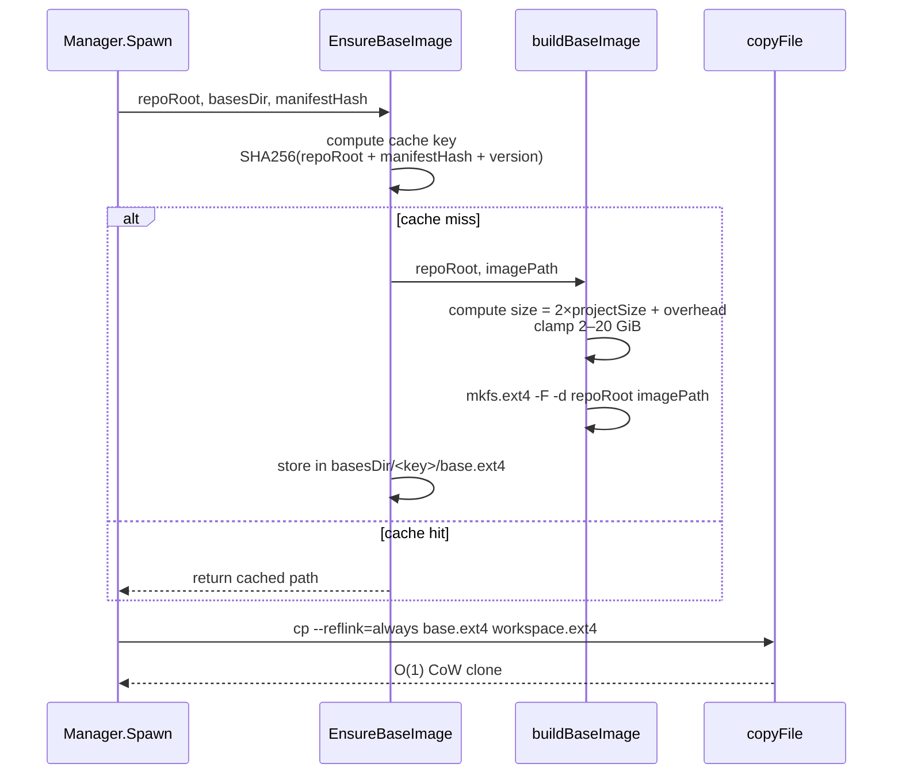

### Baking Flow

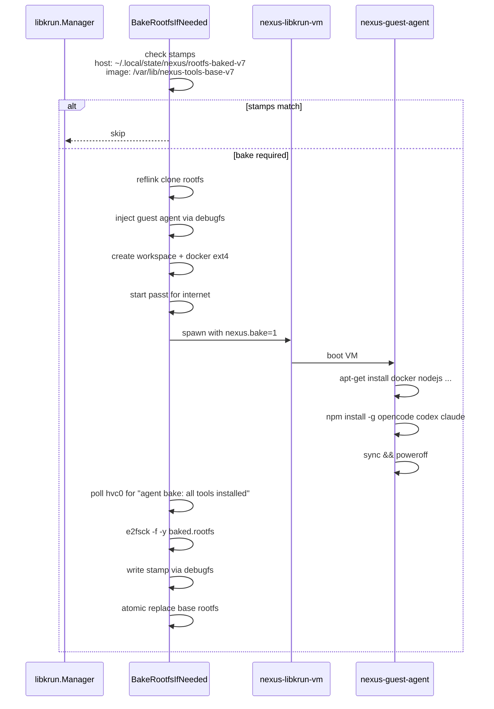

### Networking

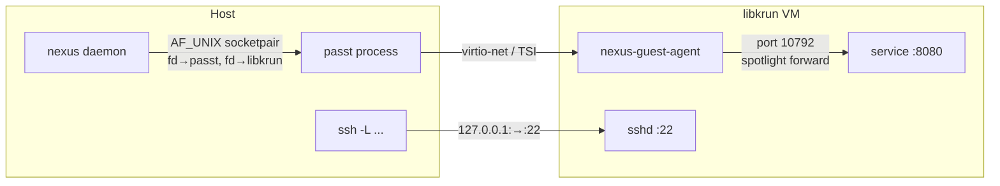

**MAC and IP assignment:** deterministically derived from `workspaceID` via FNV-1a hash. Guest IPv4 lives in the gateway's `/16` subnet.

---

## Workspace Lifecycle

### State Machine

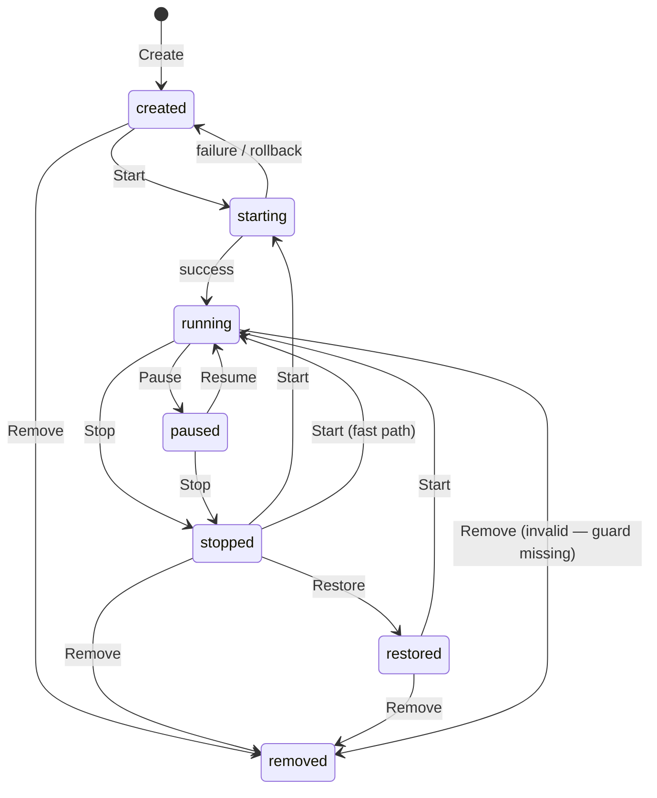

States: `created` → `starting` → `running` → `paused` → `stopped` → `restored` → `removed`

**Note:** `paused` is defined in the enum but has no RPC handlers yet; transitions to/from `paused` are unreachable.

### Fork vs Restore

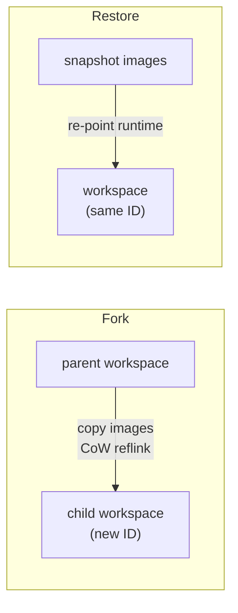

| | Fork | Restore |
|---|---|---|
| Record | **New** child ID | **Same** workspace ID |
| Lineage | Sets `ParentWorkspaceID` | No change |
| Images | Copies to `.snapshots/<childID>.*.ext4` | Reuses existing snapshot |
| Use case | Branch a new workspace | Resume from saved state |

### Driver-Specific Fork Behaviour

**libkrun driver:**
1. Stop parent VM briefly (`CheckpointFork`) for filesystem consistency.
2. `cp --reflink=always` parent workspace + docker-data images to child snapshot paths.
3. Restart parent VM.

**sandbox driver:**
1. `git worktree add <childPath> <ref>`.
2. `git diff HEAD | git apply --3way` to replay parent's uncommitted changes.

---

## Auth & Security

### Transport Security Model

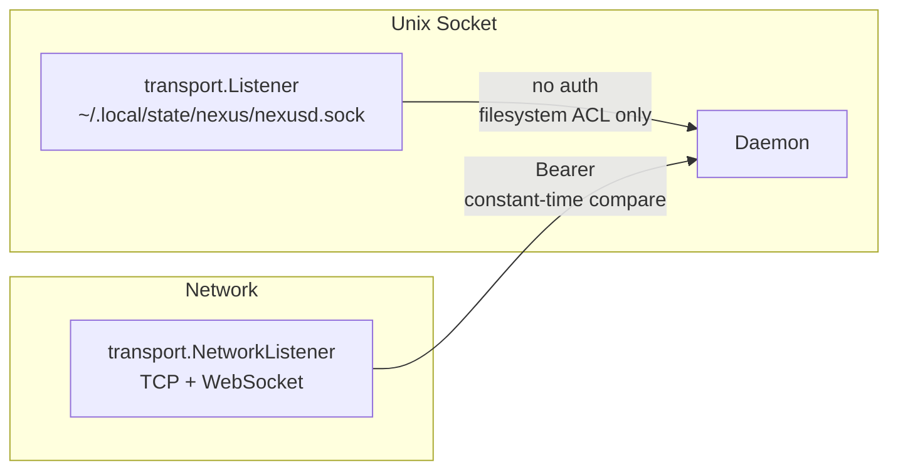

| Transport | Authentication | Notes |
|---|---|---|
| Unix socket | **None** | Any process with socket access can call any RPC |
| WebSocket / TCP | Static Bearer token | Auto-generated at daemon start; compared via `subtle.ConstantTimeCompare` |

**Caveat:** `internal/identity/` and `LocalTokenProvider` (JWT validation) exist but are **not yet wired** into the active transport path.

### Token Storage (Client-Side)

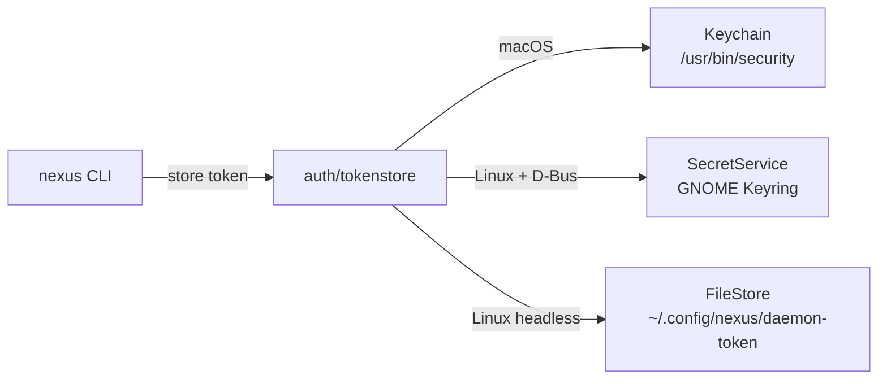

---

## Package Index

### Core Application (`internal/`)

| Package | Description |
|---------|-------------|
| `app/pty` | PTY session registry and in-process management |
| `app/spotlight` | Port-forward lifecycle orchestration |
| `app/workspace` | Workspace lifecycle: create, start, stop, fork, restore, delete |
| `domain/project` | Project entity, repository interface |
| `domain/runtime` | `Driver` interface for VM/sandbox backends |
| `domain/spotlight` | Forward entity, repository interface |
| `domain/workspace` | Workspace entity, state machine, repository interface |
| `infra/store` | SQLite persistence; implements all domain repository interfaces |
| `infra/store/migrations` | Goose migration files |
| `infra/fsworkspace` | Filesystem operations for workspace directories on daemon host |
| `infra/config` | Nexusfile config parsing |
| `infra/dockercompose` | Docker Compose port discovery |
| `infra/hostpaths` | XDG base directory helpers |
| `infra/runtime/libkrun` | libkrun microVM adapter: VM lifecycle, baking, image management |
| `infra/runtime/sandbox` | Process-isolation fallback backend |
| `infra/runtime/toolchain` | Guest toolchain readiness probe (codex/opencode/claude) |
| `infra/secrets/inject` | Secrets injection into workspace environments |
| `rpc/workspace` | Workspace lifecycle RPC handlers |
| `rpc/project` | Project CRUD RPC handlers |
| `rpc/spotlight` | Spotlight + `workspace.ports.*` handlers |
| `rpc/pty` | PTY session handlers |
| `rpc/daemon` | `node.info`, `daemon.log.tail` |
| `rpc/fs` | Filesystem RPC handlers |
| `rpc/auth` | `authrelay.mint`, `authrelay.revoke` |
| `rpc/registry` | `MapRegistry` — flat method dispatch table |
| `rpc/errors` | JSON-RPC error types |
| `transport` | Unix socket + TCP/WebSocket/TLS listeners, push notifications |
| `daemon` | Composition root — constructs and wires all layers |

### Cross-Cutting

| Package | Description |
|---------|-------------|
| `identity` | Authentication principal; `Provider` interface; `LocalTokenProvider` |
| `auth/tokenstore` | Secure token storage: Keychain / SecretService / file fallback |
| `creds/agentprofile` | Agent profile credentials |
| `creds/bundle` | Credential bundling for `workspace.create` |
| `creds/inject` | Credential injection into guest environments |
| `creds/relay` | Auth relay broker for short-lived workspace tokens |
| `tunnel` | Daemon-side SSH tunnel manager (raw `ssh` process) |

### CLI-Only (`internal/infra/cli/`)

| Package | Description |
|---------|-------------|
| `cli/daemonclient` | Auto-start local daemon; healthz polling |
| `cli/profile` | Daemon connection profiles; secure token storage integration |
| `cli/sshtunnel` | Client-side SSH tunnel manager (`ssh -fNL`) |
| `cli/mutagenbin` | Legacy Mutagen binaries (retained for build compatibility) |

### Build / Metadata

| Package | Description |
|---------|-------------|
| `build` | Build metadata via ldflags (legacy — consolidate into buildinfo) |
| `buildinfo` | Build metadata via ldflags (version, commit, time) |
| `profile` | Profile management (legacy — consolidate into cli/profile) |

### Binaries (`cmd/`)

| Package | Description |
|---------|-------------|
| `nexus` | CLI + daemon entrypoint |
| `nexus/commands/daemon` | Daemon start/stop/status CLI |
| `nexus/commands/project` | Project CLI commands |
| `nexus/commands/spotlight` | Spotlight CLI commands |
| `nexus/commands/workspace` | Workspace CLI commands |
| `nexus/commands/rpc` | RPC client helpers: `MuxConn`, `EnsureDaemon`, `Do` |
| `nexus/commands/libkrunvm` | Hidden libkrun-vm command (superseded by standalone binary) |
| `nexus-guest-agent` | In-VM guest agent (Linux only) |
| `nexus-libkrun-vm` | Standalone libkrun VM helper (CGO) |
| `schema` | JSON schema generator |
