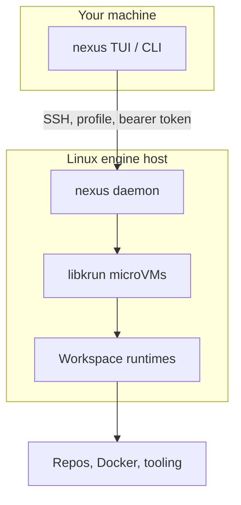

# Nexus

**Remote Linux workspaces.**  
The primary way to use Nexus is the **terminal UI**: run `nexus` or `nexus tui` to launch the interactive experience. **CLI commands** are an alternative for scripting, automation, and CI. Nexus orchestrates isolated dev environments (including libkrun microVMs) from the terminal.

[](https://asciinema.org/a/DiVttc47hmtKf262)

---

## Install (one-liner)

```bash
curl -fsSL https://raw.githubusercontent.com/oursky/nexus/main/install.sh | bash
```

Installs `nexus` into `~/.local/bin` by default (PTY sessions use the same binary via `nexus __pty-host`). Override the destination with `INSTALL_DIR`, pin a release with `NEXUS_VERSION`, or fork the install via `GITHUB_REPOSITORY`.

```bash
curl -fsSL https://raw.githubusercontent.com/oursky/nexus/main/install.sh | env INSTALL_DIR=/usr/local/bin bash
```

The script uses `sudo` only when the install destination is not user-writable.

---

## Getting started (TUI)

```bash
nexus
# or explicitly:
nexus tui
```

Use the TUI to connect to a daemon, manage workspaces, port forwards (spotlight), and shells. The SSH target and auth depend on your deployment.

---

## CLI (scripting, automation, CI)

For non-interactive and automated workflows:

```bash
# Point the CLI at a daemon (SSH target depends on your deployment)
nexus daemon connect user@your-linux-host

nexus workspace create --repo ~/my-project
nexus workspace start <workspace-id>
nexus workspace shell <workspace-id>
```

See [CLI reference](docs/reference/cli.md) for the full command tree.

---

## What it does

| Feature | How |
| ------- | --- |
| **Isolated Linux workspaces** | Lightweight libkrun microVMs — Linux kernel, Docker, isolated network |
| **TUI / CLI** | Full lifecycle: daemon, workspaces, port forwards (`spotlight`), exec |
| **Git + Docker inside the VM** | Develop and run containers in each microVM |

---

## Architecture (conceptual)



---

## Contributing

```bash
task dev:local    # local daemon + CLI (typical Linux dev)
task dev:cli      # CLI only
task build && task test
```

See [CONTRIBUTING.md](CONTRIBUTING.md) for full setup.

## Docs

- [CLI reference](docs/reference/cli.md)
- [Contributing](CONTRIBUTING.md)
