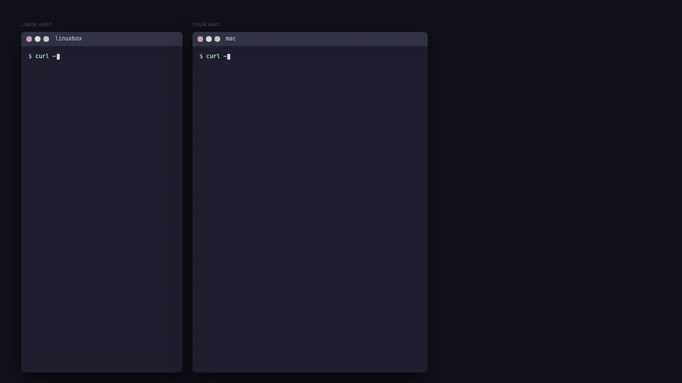
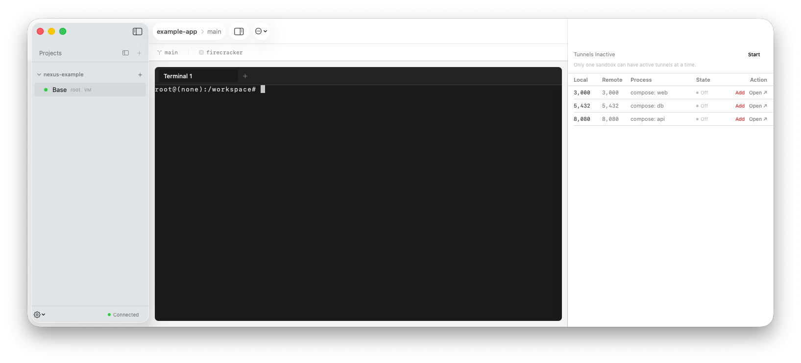

<div align="center">

# Nexus

**Remote Firecracker workspaces for Mac developers.**  
Run your dev stack inside an isolated Linux VM on a remote host — then reach it from your Mac in one command.



</div>

---

## What it does

| Feature | How |
|---------|-----|
| **Isolated Linux workspaces** | Each workspace is a Firecracker microVM — full Linux kernel, Docker, separate network |
| **One-liner deploy** | `task dev:remote` cross-compiles the daemon, deploys it over SSH, and restarts it |
| **Port forwarding (spotlight)** | `nexus spotlight start <id>` tunnels VM ports to `localhost` on your Mac |
| **Interactive VM shell** | `nexus workspace shell <id>` drops you into the running VM |
| **Git + Docker inside the VM** | Develop, commit, and run containers inside the isolated workspace |
| **macOS companion app** | Native SwiftUI app for workspace management and tunnel status |

## Install

```bash
# macOS CLI (via Homebrew)
brew install magic-nexus/tap/nexus

# Or build from source
cd packages/nexus && go build ./cmd/nexus/...
```

The daemon runs on a Linux host — see [setup guide](docs/guides/daemon-setup.md).

## Quick Start

```bash
# 1. Connect CLI to the remote daemon
nexus daemon connect user@your-linux-host

# 2. Create a workspace from a project
nexus workspace create --repo /path/on/linux/host

# 3. Start the workspace (boots Firecracker VM)
nexus workspace start <workspace-id>

# 4. Forward VM ports to localhost
nexus spotlight start <workspace-id>

# 5. Shell into the VM and develop
nexus workspace shell <workspace-id>
```

## Demo flow (as shown in the GIF above)

**Right pane (Mac):**
```bash
task dev:remote                               # build → deploy → restart daemon (one-liner)
nexus daemon connect newman@linuxbox          # connect CLI
nexus workspace start ws-<id>                 # boot Firecracker VM — discovers 3 ports
nexus spotlight start ws-<id>                 # forward web/3000, db/5432, api/8080 → localhost
curl localhost:8080                           # hit a service running inside the VM from your Mac
```

**Left pane (inside the VM via `workspace shell`):**
```bash
python3 -m http.server 8080 &                # start a service inside the isolated VM
curl localhost:8080                           # verify it's up from inside
git init && git add . && git commit -m "feat: initial project setup"
echo "# v1.0.0" >> README.md
git commit -am "docs: release v1.0.0"
git log --oneline                            # clean isolated git history
```

## macOS App



## Contributing

```bash
# One-liner: cross-compile, deploy to linuxbox, restart daemon
task dev:remote

# Or individual loops
task dev:cli    # dev:remote + rebuild CLI locally
task dev:swift  # dev:remote + rebuild Swift app
```

See [CONTRIBUTING.md](CONTRIBUTING.md) for full setup.

## Architecture

```
Mac (CLI + App)
   │  SSH tunnel (JSON-RPC 2.0 / WebSocket)
   ▼
Linux daemon (nexusd)
   │  vsock
   ▼
Firecracker microVM  ←  workspace filesystem (ext4)
   │  Docker bridge
   ▼
Your containers  (web · api · db · …)
```

## Docs

- [Architecture](ARCHITECTURE.md)
- [CLI reference](docs/reference/cli.md)
- [Contributing](CONTRIBUTING.md)
- [Daemon setup](docs/guides/daemon-setup.md)
