# Nexus TUI — Comprehensive UI/UX Specification

> **Status**: Design reference — guides the next visual overhaul of `packages/nexus/internal/tui/`
> **Audience**: Implementation agents and contributors
> **Based on**: Code audit of `tui.go`, `styles.go`, `workspace_list.go`, `connect_info.go`;
> research into lazygit, k9s, gitui, broot, gh-dash, bottom/btm, Bubble Tea bubbles, Lip Gloss v2

---

## A. Design Philosophy

### A.1 Inspiration Sources

| TUI | What We Take |
|-----|-------------|
| **lazygit** | Panel focus rings with distinct borders; context-sensitive footer help bar (not one collapsed line); `?` opens a properly formatted help overlay; confirmations are modal prompts not inline text |
| **k9s** | Breadcrumb/context bar at top showing current view; table layout for multi-column data; resource state shown as colored badge + symbol; descriptive status line that animates during loading |
| **gh-dash** | Tab bar for switching sub-views; PR/issue cards with right-aligned status badges; glamour-rendered markdown in detail panes |
| **bottom/btm** | Widget focus ring (visible border colour change on focus); `e` to expand a widget to full screen; responsive grid that reflows at terminal breakpoints |
| **broot** | Fuzzy filter is always visible as a subtle input at top of list, not a modal takeover |
| **gitui** | Vim-complete navigation (h/j/k/l, g/G, ctrl-d/u); minimal colour palette that works on both dark and light backgrounds |

### A.2 Core Principles

1. **Information density without clutter** — every pixel earns its place. Show the three most important attributes of a workspace inline in the list (name, state badge, repo short-name). Don't dump raw UUIDs unless the user drills in.
2. **Keyboard-first, zero-mouse** — all flows reachable with ≤4 keystrokes from any state. Focus is always visually obvious (border colour change, not just cursor position).
3. **SSH-friendly** — renders correctly on a 80×24 mosh session over a 50ms link. No animations that require a high-refresh terminal. Fallback to ASCII borders when unicode is unavailable.
4. **Visual hierarchy through structure** — regions are separated by single-line borders, not blank lines. Headers, body, and footer are distinct zones. The eye travels top→down predictably.
5. **Adaptive colour** — use `lipgloss.AdaptiveColor` throughout so the TUI looks intentional on both dark and light terminal themes. Never assume a black background.
6. **Feedback on every action** — no silent voids. Every RPC call shows either a spinner or an immediate status line update. Errors are prominent; success is calm.

### A.3 What We Explicitly Avoid

- Flashy gradient animations or rainbow-coloured title art
- Mouse-required interactions (no click-only targets)
- Colour as the **only** differentiator — every state badge also uses a symbol
- Overwhelming palettes — maximum 6 semantic colour tokens (see §C)
- Hard-coded dark-only hex values — current `styles.go` is entirely dark-only
- Hiding the key hint footer — it must always be visible (shrink it at narrow widths, never remove it)
- Full-screen modal dialogs for small confirmations — use an inline confirmation bar

---

## B. Layout System

### B.1 Screen Zones (all widths)

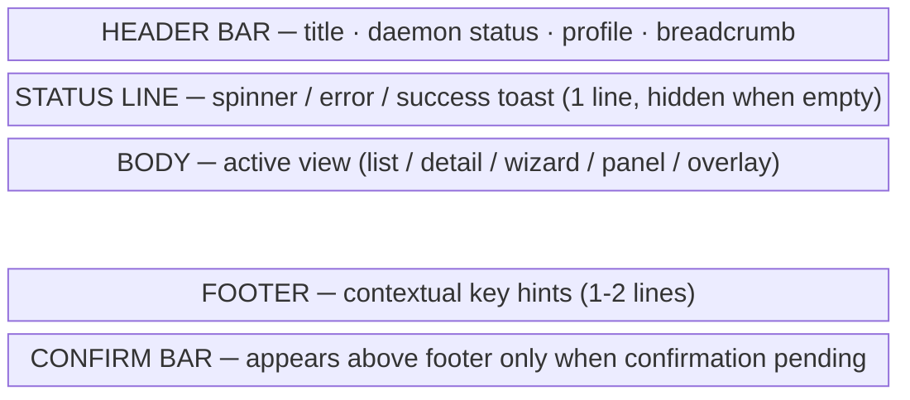

- Header: 1 line always visible
- Status line: 1 line; collapses to 0 height when empty
- Body: fills remaining height
- Footer: 1–2 lines; always visible (truncated at <60 cols)
- ConfirmBar: 1 line; renders between Body and Footer only when `confirmDelete == true` or similar

### B.2 Component Tree — Main List View

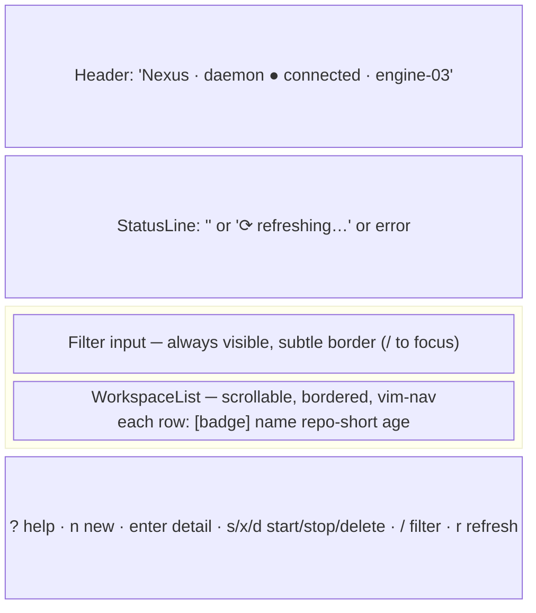

### B.3 Component Tree — Detail + Action Bar View

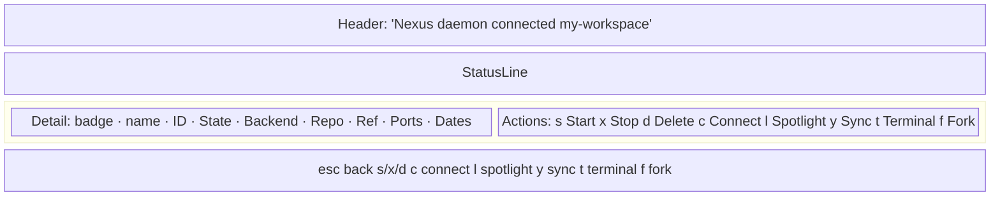

### B.4 Component Tree — Create Wizard

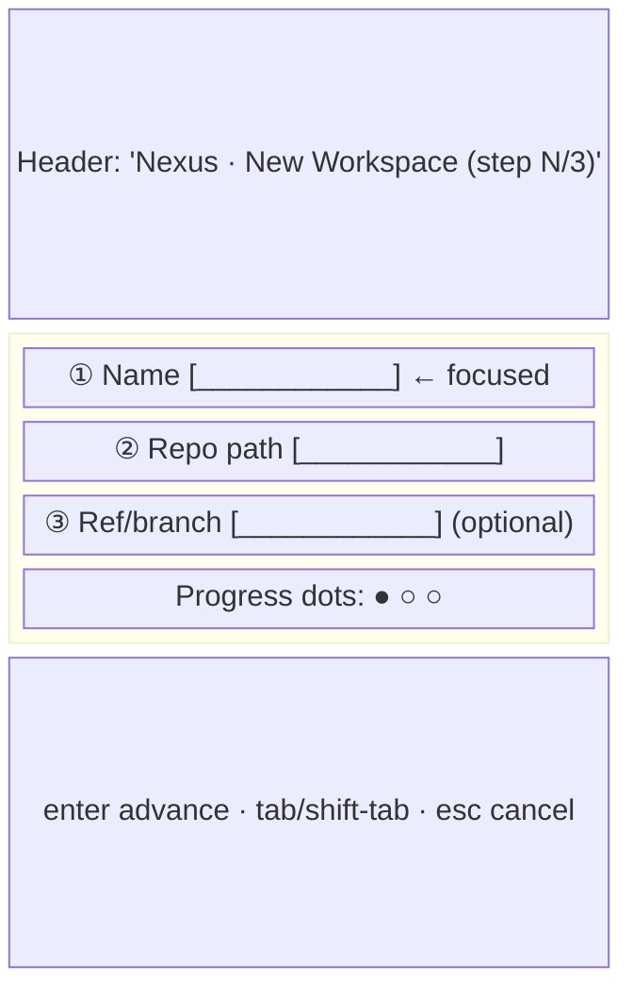

### B.5 Component Tree — Spotlight Sub-Panel

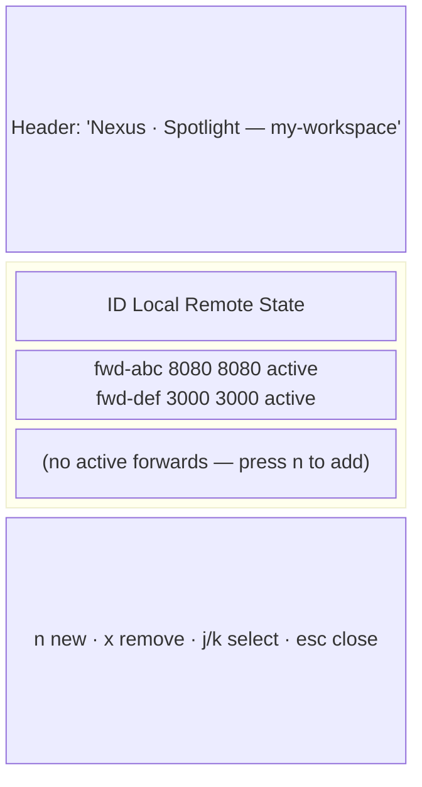

### B.6 Component Tree — Sync Sub-Panel

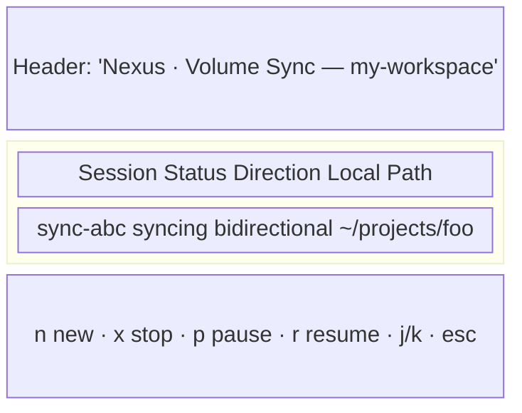

### B.7 Component Tree — Connect/SSH Overlay

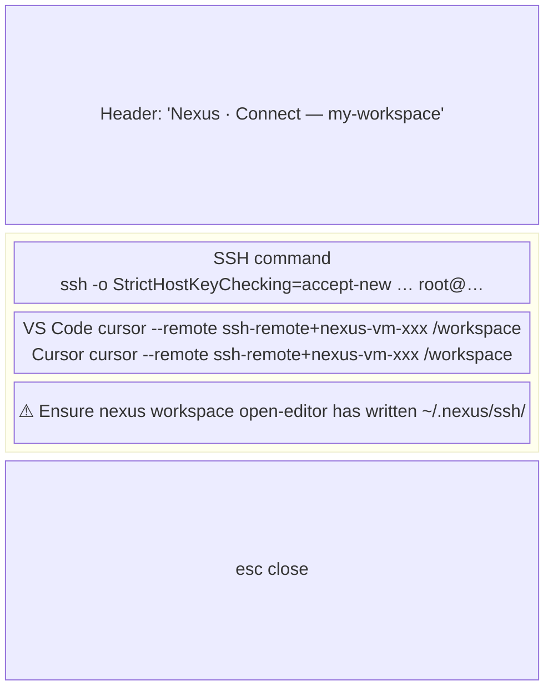

### B.8 Component Tree — Delete Confirm (inline bar, not modal)

The confirm bar is an inline zone between body and footer, not a full overlay:

```mermaid
block-beta
  columns 1
  Body["(body continues at reduced height)"]
  Confirm["⚠  Delete 'my-workspace' (ws-abc…)?   [y] confirm   [n/esc] cancel"]
  Footer[""]
```

### B.9 Component Tree — Help Overlay

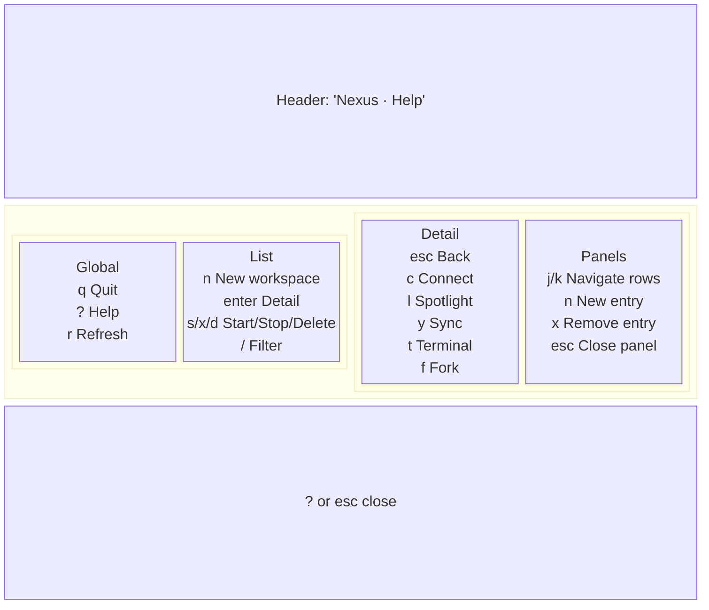

---

## C. Colour & Typography System

### C.1 Token Table

| Token | Purpose | Dark terminal | Light terminal |
|-------|---------|--------------|----------------|
| `ColorAccent` | Brand colour, titles, focused borders | `#EE6FF8` (magenta) | `#9B00C9` |
| `ColorOk` | Running/connected/success | `#04B575` (green) | `#007A4D` |
| `ColorWarn` | Starting/degraded/warning | `#FFB86C` (orange) | `#B56A00` |
| `ColorErr` | Stopped (voluntary)/error/delete | `#FF5F87` (pink-red) | `#C0003D` |
| `ColorMuted` | Labels, hints, secondary text | `#626262` | `#888888` |
| `ColorFg` | Primary text | `#E8E8E8` | `#1A1A1A` |
| `ColorFgSubtle` | Descriptions, secondary values | `#A8A8A8` | `#555555` |
| `ColorBorderFocus` | Border of the focused panel | `#EE6FF8` | `#9B00C9` |
| `ColorBorderNormal` | Border of unfocused panels | `#3A3A3A` | `#CCCCCC` |
| `ColorSelectedBg` | Selected list row background | `#2A2A4A` | `#E8E0FF` |

### C.2 State Badge Rules

Every workspace state is rendered as `symbol + colour + label` — never colour alone:

| State | Symbol | Colour token | Display |
|-------|--------|-------------|---------|
| `running` | `●` | `ColorOk` | `● running` |
| `starting` | `⟳` | `ColorWarn` | `⟳ starting` (with spinner) |
| `stopping` | `⟳` | `ColorWarn` | `⟳ stopping` |
| `stopped` | `○` | `ColorMuted` | `○ stopped` |
| `created` | `◇` | `ColorFgSubtle` | `◇ created` |
| `error` | `✗` | `ColorErr` | `✗ error` |

> **Rule**: never render raw `string(ws.State)` in the list title — always go through a `stateLabel()` function that maps state → symbol+style.

### C.3 Lip Gloss Pseudo-Code Definitions

```go
// Adaptive colour helpers
func dark(d, l string) lipgloss.AdaptiveColor {
    return lipgloss.AdaptiveColor{Dark: d, Light: l}
}

var (
    colorAccent      = dark("#EE6FF8", "#9B00C9")
    colorOk          = dark("#04B575", "#007A4D")
    colorWarn        = dark("#FFB86C", "#B56A00")
    colorErr         = dark("#FF5F87", "#C0003D")
    colorMuted       = dark("#626262", "#888888")
    colorFg          = dark("#E8E8E8", "#1A1A1A")
    colorFgSubtle    = dark("#A8A8A8", "#555555")
    colorBorderFocus = dark("#EE6FF8", "#9B00C9")
    colorBorderNorm  = dark("#3A3A3A", "#CCCCCC")
    colorSelectedBg  = dark("#2A2A4A", "#E8E0FF")

    titleStyle = lipgloss.NewStyle().Bold(true).Foreground(colorAccent)

    panelStyle = lipgloss.NewStyle().
        Border(lipgloss.RoundedBorder()).
        BorderForeground(colorBorderNorm).
        Padding(0, 1)

    focusedPanelStyle = panelStyle.Copy().
        BorderForeground(colorBorderFocus)

    keyHintStyle  = lipgloss.NewStyle().Foreground(colorMuted)
    keyLabelStyle = lipgloss.NewStyle().Foreground(colorFgSubtle).Bold(true)

    stateRunStyle  = lipgloss.NewStyle().Foreground(colorOk)
    stateWarnStyle = lipgloss.NewStyle().Foreground(colorWarn)
    stateErrStyle  = lipgloss.NewStyle().Foreground(colorErr)
    stateMutStyle  = lipgloss.NewStyle().Foreground(colorMuted)

    confirmBarStyle = lipgloss.NewStyle().
        Background(dark("#3A1A00", "#FFF0D0")).
        Foreground(colorWarn).
        Bold(true).
        Padding(0, 2)

    toastErrStyle = lipgloss.NewStyle().
        Background(dark("#4A0020", "#FFE0E8")).
        Foreground(colorErr).
        Padding(0, 1)

    toastOkStyle = lipgloss.NewStyle().
        Background(dark("#003A20", "#D0FFE8")).
        Foreground(colorOk).
        Padding(0, 1)
)
```

### C.4 Typography Rules

- **Titles / section headers**: `titleStyle` (bold, accent colour) — used once per view
- **Key labels in detail view**: `keyLabelStyle` (subtle, bold) — right-padded to column width
- **Values in detail view**: default `colorFg` — never muted
- **Footer hints**: format as `key  description` pairs separated by `·`, rendered in `keyHintStyle`
- **Inline prompt labels**: `keyLabelStyle` with `> ` prompt in `colorAccent`

---

## D. Component Specifications

### D.1 StatusBar (header + status line)

**80-col mockup:**
```
 Nexus · daemon ● connected · engine-03
 ⟳ refreshing workspaces…
```

**120-col mockup:**
```
 Nexus  ·  daemon ● connected  ·  profile: engine-03  ·  4 workspaces          r refresh
 ⟳ refreshing workspaces…
```

**Fields**: title (static), daemon status (connected/disconnected/degraded/exiting), profile host from `profile.LoadDefault()`, workspace count (from list length), optional refresh shortcut at wide widths.

**States**:
- Loading: status line shows spinner + "connecting…"
- Connected: `● connected` in `colorOk`
- Degraded: `◐ degraded` in `colorWarn`
- Disconnected: `○ disconnected` in `colorErr`

**Keyboard**: none (display-only)

---

### D.2 WorkspaceList

**80-col mockup (5 workspaces):**
```
╭─ Workspaces  (5) ──────────────────────────────────────────────────────────╮
│  / filter…                                                                 │
│                                                                            │
│  ▶  ● my-project          nexus     2h ago                                 │
│     ● api-backend         backend   1d ago                                 │
│     ⟳ new-feature         nexus     5m ago                                 │
│     ○ old-experiment      myrepo    3d ago                                 │
│     ◇ waiting-workspace   —         just now                               │
│                                                                            │
╰────────────────────────────────────────────────────────────────────────────╯
```

**120-col mockup:**
```
╭─ Workspaces  (5) ──────────────────────────────────────────────────────────────────────────────────────╮
│  / filter…                                                                                             │
│                                                                                                        │
│  ▶  ● my-project          ~/magic/nexus              running   2h ago                                  │
│     ● api-backend         ~/projects/backend         running   1d ago                                  │
│     ⟳ new-feature         ~/magic/nexus              starting  5m ago                                  │
│     ○ old-experiment      ~/projects/myrepo          stopped   3d ago                                  │
│     ◇ waiting-workspace   —                          created   just now                                │
│                                                                                                        │
╰────────────────────────────────────────────────────────────────────────────────────────────────────────╯
```

**Fields**: state badge (symbol + colour), name (truncated to 24), repo short-name (truncated), relative age from `UpdatedAt`.

**States**: focused (border in `colorBorderFocus`), unfocused (border in `colorBorderNorm`), filtering (filter input highlighted), loading (spinner replaces list content for first load), empty (centred "No workspaces. Press n to create one.").

**Keyboard (list focused)**:
| Key | Action |
|-----|--------|
| `j/↓` | Move down |
| `k/↑` | Move up |
| `g/G` | Jump to top/bottom |
| `ctrl+d/u` | Page down/up |
| `enter` | Open detail view |
| `n` | New workspace wizard |
| `s` | Start selected |
| `x` | Stop selected |
| `d` | Delete selected (shows confirm bar) |
| `/` | Focus filter input |
| `esc` (in filter) | Clear filter, exit filter mode |
| `r` | Manual refresh |

---

### D.3 DetailPane

**80-col mockup:**
```
╭─ my-project ──────────────────────────────────────────────────────────────╮
│  ● running                                                                │
│                                                                           │
│  ID          ws-a1b2c3d4e5f6                                              │
│  Backend     sandbox                                                      │
│  Repo        ~/magic/nexus                                                │
│  Ref         main                                                         │
│  Root path   /home/newman/magic/nexus                                     │
│  Ports       8080, 3000                                                   │
│  Guest IP    192.168.100.2                                                │
│  Created     2 days ago  (2026-05-12T09:00:00Z)                           │
│  Updated     2 hours ago                                                  │
│                                                                           │
│  Actions: s start · x stop · d delete · c connect                        │
│           l spotlight · y sync · t terminal · f fork                     │
╰───────────────────────────────────────────────────────────────────────────╯
```

**120-col mockup** (right column shows action list):
```
╭─ my-project ──────────────────────────────────────────────────────────╮  ╭─ Actions ──────────────╮
│  ● running                                                            │  │  s  Start              │
│                                                                       │  │  x  Stop               │
│  ID          ws-a1b2c3d4e5f6                                          │  │  d  Delete             │
│  Backend     sandbox                                                  │  │  ─────────────         │
│  Repo        ~/magic/nexus                                            │  │  c  Connect/SSH        │
│  Ref         main                                                     │  │  l  Spotlight          │
│  Root path   /home/newman/magic/nexus                                 │  │  y  Volume Sync        │
│  Ports       8080, 3000                                               │  │  t  Terminal           │
│  Guest IP    192.168.100.2                                            │  │  f  Fork               │
│  Created     2 days ago                                               │  │                        │
│  Updated     2 hours ago                                              │  ╰────────────────────────╯
╰───────────────────────────────────────────────────────────────────────╯
```

**States**: loading (spinner, "Loading workspace details…"), error (red error message in panel), action-in-flight (spinner in status line, fields still visible).

**Keyboard**:
| Key | Action |
|-----|--------|
| `esc/enter` | Back to list |
| `s/x/d` | Start/stop/delete |
| `c` | Open Connect overlay |
| `l` | Open Spotlight panel |
| `y` | Open Sync panel |
| `t` | Launch terminal (`ExecProcess`) |
| `f` | Fork prompt |
| `r` | Refresh detail |

---

### D.4 SpotlightPanel

**80-col mockup:**
```
╭─ Spotlight Forwards  —  my-project ─────────────────────────────────────╮
│  ID          Local   Remote  State                                       │
│  ──────────  ─────   ──────  ──────                                      │
│▶ fwd-a1b2    8080    8080    ● active                                    │
│  fwd-c3d4    3000    3000    ● active                                    │
│                                                                          │
│  (no more forwards)                                                      │
╰──────────────────────────────────────────────────────────────────────────╯
```

**States**: empty ("No active forwards. Press n to expose a port."), loading (spinner), selected row highlighted with `colorSelectedBg`.

**Keyboard**: `j/k` navigate, `n` new (prompts for remote port), `x` remove selected, `esc` close.

---

### D.5 SyncPanel

**80-col mockup:**
```
╭─ Volume Sync  —  my-project ────────────────────────────────────────────╮
│  Session    Status    Direction     Local Path                           │
│  ─────────  ────────  ────────────  ────────────────────────             │
│▶ sync-a1b   ⟳ syncing  bidirectional  ~/projects/foo                    │
│  sync-c3d   ■ paused   up             ~/projects/bar                    │
╰──────────────────────────────────────────────────────────────────────────╯
```

**Keyboard**: `j/k`, `n` new session (local path prompt → direction prompt), `x` stop, `p` pause, `r` resume, `esc` close.

---

### D.6 ConnectPanel

**80-col mockup:**
```
╭─ Connect / SSH  —  my-project ─────────────────────────────────────────╮
│  ProxyJump    engine-03                                                 │
│  SSH target   root@192.168.100.2                                        │
│  Host alias   nexus-vm-ws-a1b2c3d4                                      │
│                                                                         │
│  SSH command                                                            │
│  ssh -o StrictHostKeyChecking=accept-new -J engine-03 root@192.168.1…  │
│                                                                         │
│  VS Code      code --remote ssh-remote+nexus-vm-ws-a1b2c3d4 /workspace │
│  Cursor       cursor --remote ssh-remote+nexus-vm-ws-a1b2… /workspace  │
│                                                                         │
│  ⚠ Run nexus workspace open-editor to write SSH config first           │
╰─────────────────────────────────────────────────────────────────────────╯
```

**Keyboard**: `esc` or `c` close.

---

### D.7 WizardForm

**80-col mockup (step 1/3 focused):**
```
╭─ New Workspace  ● ○ ○ ───────────────────────────────────────────────────╮
│                                                                           │
│  ① Name                                                                   │
│  ╔══════════════════════════════════════════════════════════╗             │
│  ║ my-new-workspace_                                        ║             │
│  ╚══════════════════════════════════════════════════════════╝             │
│                                                                           │
│  ② Repo path                                                              │
│  ┌──────────────────────────────────────────────────────────┐             │
│  │ repo path on engine (required)                           │             │
│  └──────────────────────────────────────────────────────────┘             │
│                                                                           │
│  ③ Ref / branch                                                           │
│  ┌──────────────────────────────────────────────────────────┐             │
│  │ ref / branch (optional)                                  │             │
│  └──────────────────────────────────────────────────────────┘             │
│                                                                           │
╰─────────────────────────────────────────────────────────────── enter ▶ ──╯
```

Active field uses double-line box (`╔╗╚╝`); inactive fields use single-line box. Progress dots show current step.

**Keyboard**: `tab/shift-tab` switch fields, `enter` advance/submit, `esc` cancel. Validation error shown in status line (not inline).

---

### D.8 ConfirmDialog (inline bar)

```
────────────────────────────────────────────────────────────────────────────
 ⚠  Delete 'my-project' (ws-a1b2c3d4)?   y  confirm   n / esc  cancel
────────────────────────────────────────────────────────────────────────────
```

Rendered as a full-width bar in `confirmBarStyle` between the body and footer. No separate overlay.

---

### D.9 HelpOverlay

**80-col mockup:**
```
╭─ Key Reference ────────────────────────────────────────────────────────────╮
│                                                                            │
│  Global              List                  Detail                          │
│  q    Quit           n  New workspace      esc  Back to list               │
│  ?    Help           enter  Detail         c    Connect / SSH              │
│  r    Refresh list   s  Start              l    Spotlight ports            │
│  /    Filter list    x  Stop               y    Volume sync                │
│                      d  Delete             t    Terminal                   │
│  Panels              g/G  Top/bottom       f    Fork workspace             │
│  j/k  Navigate       ctrl-d/u  Page        s/x/d  Start/stop/delete       │
│  n    New entry                                                            │
│  x    Remove         Spotlight             Sync                            │
│  esc  Close          n  Expose port        n  New session                  │
│                      x  Remove forward     x  Stop session                 │
│                                            p/r  Pause / resume             │
│                                                                            │
╰──────────────────────────────────────────────? or esc  close help ────────╯
```

---

### D.10 ToastStack

Toasts are rendered in the status-line slot (1 line). They self-dismiss after a timeout:

| Type | Duration | Style |
|------|----------|-------|
| Success | 2s | `toastOkStyle`: green background |
| Error | 5s (or until keypress) | `toastErrStyle`: red background |
| Info | 3s | `mutedStyle`: no background |

Implementation: add a `toastMsg` and `toastExpiry time.Time` to the model; a `tea.Tick` clears it.

---

## E. State Machine Diagrams

### E.1 App-Level Navigation

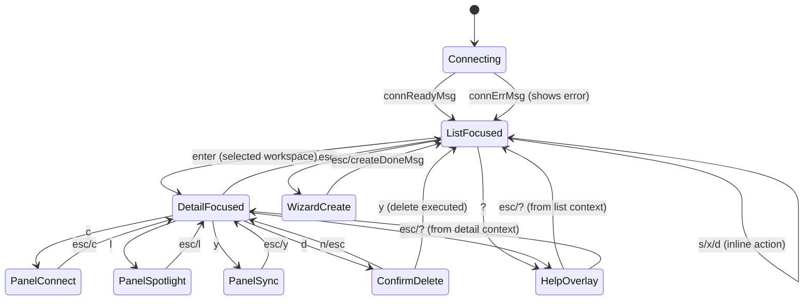

### E.2 Workspace Action Flow

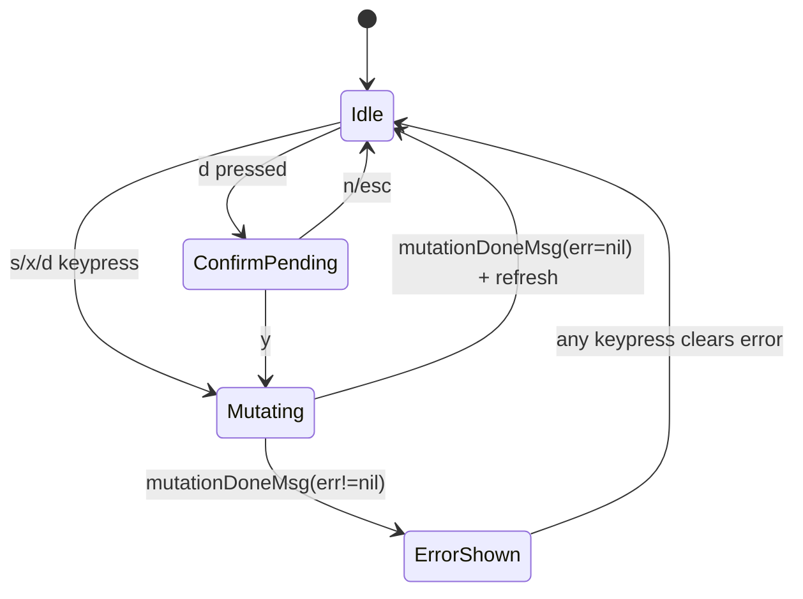

### E.3 Create Wizard Steps

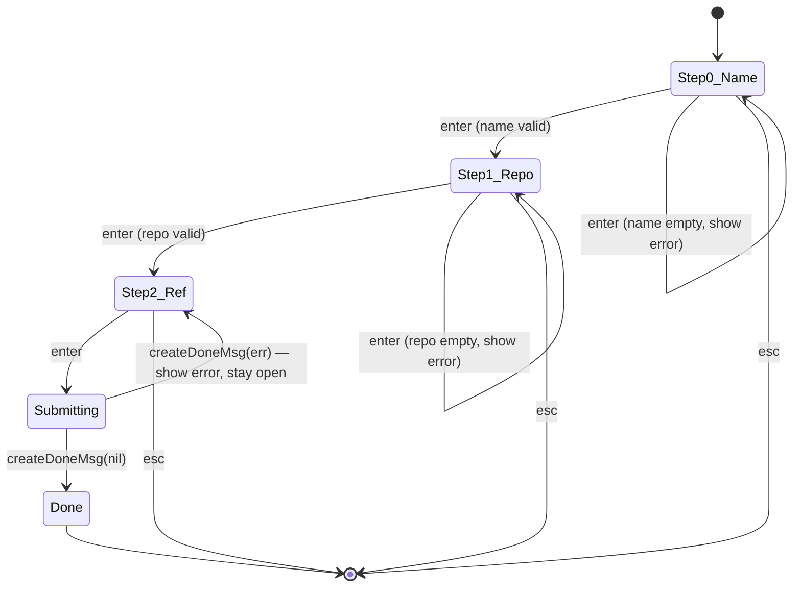

### E.4 Daemon Connection Lifecycle

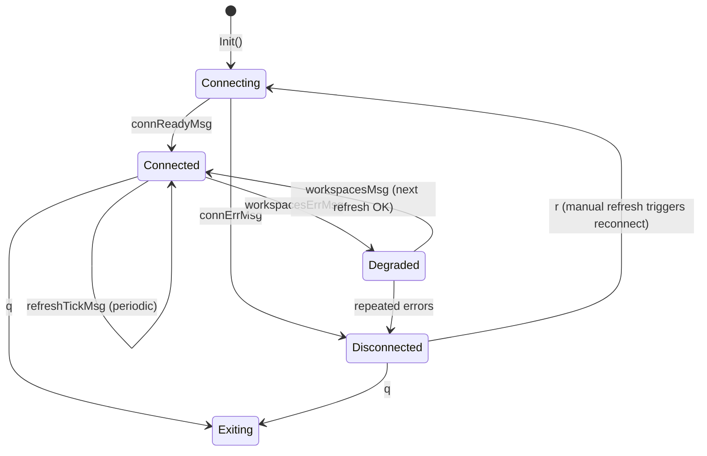

---

## F. Animation & Feedback

### F.1 Spinner Usage

Use `bubbles/spinner` with `spinner.MiniDot` style (low-bandwidth, works on all terminals):

| State | Where | Spinner |
|-------|-------|---------|
| Daemon connecting | StatusLine | `⠋ connecting…` |
| Workspaces loading (first load) | Body (centre of list area) | `⠋ loading workspaces…` |
| Workspaces refreshing (background) | StatusLine only, not over list | `⠋ refreshing…` |
| Workspace starting/stopping | State badge in list row | Replace static badge with spinner |
| RPC mutation in flight | StatusLine | `⠋ working…` |

**Rule**: spinners replace static content only in the status line or state badge — never obscure the full body.

### F.2 Progress Bars

The `bubbles/progress` component should be used for workspace creation when the daemon emits progress events. If no progress stream is available, show a bouncing progress bar (indeterminate). Width = list panel width − 4.

### F.3 Toast Timing

```
action completes → toastMsg set + toastExpiry = now + duration
                 → tea.Tick(duration, clearToast) scheduled
On next tick: if now > toastExpiry → statusLine = ""
Error toasts: also dismissed by any non-navigation keypress
```

### F.4 Transition Feel

Bubble Tea re-renders on every message. There are no cross-fade animations — view switches are instantaneous. This is correct and desirable for SSH sessions. The "animation" feel comes from:
- Spinners updating every 80ms tick
- State badges changing colour as workspace state changes
- Toast appearing/disappearing with clear timing

---

## G. Responsive Behaviour

| Width | Layout | Changes |
|-------|--------|---------|
| < 60 cols | **Minimal** | Hide footer key labels (show just keys: `q?rn/sxd`); truncate names to 12 chars; hide repo column in list |
| 60–79 cols | **Standard** | Standard layout; show name + state badge + age; footer on 2 lines |
| 80–119 cols | **Comfortable** | Full list columns (name, state, repo-short, age); footer on 1 line; bordered panels |
| ≥ 120 cols | **Wide** | Side-by-side layout: list left (50%) + detail/actions right (50%) |

### G.1 Wide Layout (≥120 cols)

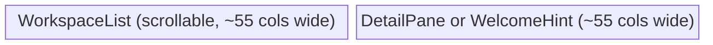

At wide widths, selecting a workspace in the list immediately populates the right pane with its detail (no `enter` required to drill in — `enter` still works for explicit focus). The right pane border changes to `colorBorderFocus` when detail is in focus. `esc` from the detail pane returns focus to the list without clearing the detail.

### G.2 Footer Adaptation

```
< 60 cols:   q?  r  n  s  x  d  /
60-79 cols:  q quit · ? help · r refresh · n new · s/x/d · / filter
≥ 80 cols:   q quit · ? help · n new workspace · enter detail · s/x/d start/stop/delete · / filter · r refresh
```

---

## H. Accessibility & SSH Friendliness

### H.1 Colour-Only Prohibition

Every state indicator pairs a **symbol** with a colour:
- `● running` (not just green text)
- `○ stopped` (not just grey text)
- `✗ error` (not just red text)

This ensures users with colour-blind terminals or monochrome SSH clients can distinguish states.

### H.2 `NO_COLOR` / Plain-ASCII Mode

Detect `os.Getenv("NO_COLOR") != ""` or `os.Getenv("TERM") == "dumb"` at startup. In this mode:
- All `lipgloss.Color` values set to `lipgloss.NoColor{}`
- Borders switch from `RoundedBorder()` to `NormalBorder()` (plain `+`, `-`, `|`)
- Unicode symbols (`●`, `○`, `⟳`) fall back to ASCII: `*`, `-`, `~`
- Bold/underline text attributes still apply (ANSI 1/4 codes, nearly universal)

Implement via a `renderCfg` struct passed to all render functions:

```go
type renderCfg struct {
    NoColor bool   // NO_COLOR env set
    ASCII   bool   // TERM=dumb or COLUMNS<40
}
```

### H.3 Narrow/SSH Terminal Resilience

- All `truncate()` calls check against actual `m.width`, not a hardcoded constant
- The layout never renders wider than `m.width` — use `lipgloss.NewStyle().MaxWidth(m.width)`
- Panels fall back to no-border rendering below 40 cols
- Help overlay scrolls with `viewport` component rather than assuming screen height ≥ 30

### H.4 Latency-Resilient Design

- The workspace list remains visible and interactive while a background refresh runs (spinner in status line only)
- Detail panel shows last-known data during re-fetch; spinner in panel title indicates staleness
- If initial connection fails, the body shows a clear error with a retry hint (`r to retry`)
- The `5s` auto-refresh tick (`tickRefresh`) should be suspended while an overlay/panel is open (already implemented: `!m.blocksOverlayInput()`)

### H.5 Unicode Fallback Map

| Unicode | ASCII fallback |
|---------|----------------|
| `●` | `*` |
| `○` | `-` |
| `◇` | `+` |
| `⟳` | `~` |
| `✗` | `!` |
| `▶` | `>` |
| `·` (separator) | `.` |
| `╭╮╰╯─│` | `+-++-|` |
| `╔╗╚╝` (active input) | `****` |

---

## I. Comparison Table

| Dimension | **Nexus TUI (current)** | **k9s** | **lazygit** | **gh-dash** |
|-----------|------------------------|---------|-------------|-------------|
| Layout | Flat, no borders | Table + header bar + breadcrumb | Multi-panel with focus borders | Tab bar + table + right pane |
| Keyboard | Partial vim (j/k), no g/G, no ctrl-d/u | Full vim + `:cmd` palette | Full vim + number jumps | Full vim + ctrl shortcuts |
| Colour system | Hard-coded dark hex, no adaptive | Full skin system (YAML) | Theme files, adaptive | Glamour themes + lipgloss |
| State colours | State as raw text, uncoloured | Badge + colour + symbol | Colour per file status | PR status badge colour |
| Filtering | Bubbles list filter (functional) | Live fuzzy filter in header | Fuzzy filter per panel | Configured sections/filters |
| Detail depth | Plain key-value, no structure | Full resource YAML | Full diff + metadata | PR body via glamour |
| Confirm dialogs | Inline `[y/N]` line, no modal | Dedicated confirm dialog | Modal overlay | Modal overlay |
| Loading feedback | No spinner, no visual cue | Spinner in header + animated | Spinner per panel | Spinner in tab label |
| Responsive | None (fixed listWidth) | Responsive grid | Responsive panels | Adaptive column widths |
| Terminal compat | No `NO_COLOR` support | `NO_COLOR` respected | `NO_COLOR` respected | `NO_COLOR` respected |

---

## J. Implementation Priorities

Ranked from highest visible impact to lowest, with specific code locations:

### Priority 1 — State colour badges in the list  ⭐⭐⭐⭐⭐
**File**: `workspace_list.go`, `workspaceItem.Title()`  
**Current code** (line 26): `fmt.Sprintf("%s  •  %s", truncate(name, 28), st)` — raw uncoloured state string  
**Change**: extract `stateLabel(state)` that returns `lipgloss`-styled `"● running"`, `"○ stopped"`, etc.  
This single change makes the list immediately scannable at a glance.

### Priority 2 — Bordered panel regions  ⭐⭐⭐⭐
**File**: `tui.go`, `View()` function (line 1057)  
**Current**: flat `lipgloss.JoinVertical` with no borders  
**Change**: wrap the list and each panel body in `panelStyle` / `focusedPanelStyle`; add `colorBorderFocus` to the active panel. Use `lipgloss.RoundedBorder()`.  
This alone transforms the visual feel from "raw text dump" to "structured TUI".

### Priority 3 — Adaptive colours in styles.go  ⭐⭐⭐⭐
**File**: `styles.go` (entire file, 28 lines)  
**Current**: all 7 styles use hard-coded dark hex e.g. `#626262`  
**Change**: replace all `lipgloss.Color("hex")` with `lipgloss.AdaptiveColor{Dark: "hex", Light: "hex"}`. Also add the full token set from §C.1.  
This is a safe low-risk change with high correctness payoff on light-background terminals.

### Priority 4 — Structured footer key hints  ⭐⭐⭐
**File**: `tui.go`, `View()` lines 1104–1125  
**Current**: a single `mutedStyle.Render("q quit · ? help · …long string…")` that wraps arbitrarily  
**Change**: render footer as a `lipgloss.JoinHorizontal` of individually styled `key · label` pairs, clipped to `m.width`. Add responsive shortening per §G.2.

### Priority 5 — Spinner during connecting/refreshing  ⭐⭐⭐
**File**: `tui.go`, `Model` struct + `Update()` + `View()`  
**Current**: `statusLine: "connecting…"` set once, never animated  
**Change**: add `spinner bubbles/spinner.Model` to `Model`; send `spinner.Tick` cmd during connection/mutation states; render spinner in status line via `m.spinner.View()`.

### Priority 6 — Focused input border in wizard  ⭐⭐
**File**: `tui.go`, `renderCreateWizard()` (line 1148)  
**Current**: bare `textinput.View()` output, no visual step differentiation  
**Change**: wrap the active `textinput` in a highlighted border; wrap inactive inputs in a muted border; show progress dots at top of wizard.

### Priority 7 — Improved confirm bar  ⭐⭐
**File**: `tui.go`, `View()` lines 1127–1131  
**Current**: `warningStyle.Render("Delete workspace %s? [y/N]")` inline  
**Change**: render as a full-width coloured bar using `confirmBarStyle`, consistent width, clear `y` / `n/esc` labels with distinct key styling.

### Priority 8 — Toast system  ⭐⭐
**File**: `tui.go`, `Model` + `Update()` + `View()`  
**Current**: `m.statusLine` is overwritten by next message with no persistence  
**Change**: add `toast string`, `toastExpiry time.Time`, `toastKind (ok/err/info)` to model. Auto-dismiss after 2–5s via `tea.Tick`. Style with `toastOkStyle` / `toastErrStyle`.

### Priority 9 — Wide-terminal split layout  ⭐
**File**: `tui.go`, `View()` + `Update()` (WindowSizeMsg handler)  
**Current**: `m.listWidth = max(msg.Width-4, 24)` — always full-width list  
**Change**: when `m.width >= 120`, compute `leftW = m.width/2 - 2` and `rightW = m.width - leftW - 4`; render `lipgloss.JoinHorizontal(lipgloss.Top, listPanel, detailPanel)`.

### Priority 10 — g/G, ctrl-d/u navigation  ⭐
**File**: `tui.go`, `handleListKeys()` (line 980)  
**Current**: navigation delegated to `m.list.Update(msg)`, which already handles some keys  
**Change**: add explicit `"g"` → `m.list.Select(0)`, `"G"` → `m.list.Select(len-1)`, `"ctrl+d"` / `"ctrl+u"` → page navigation helpers.

---

*End of original spec — total views: 8, total state machines: 4, total component specs: 10, total implementation items: 10.*

---

## K. Terminal-First Session Tabs (k9s-style)

> **Design decision**: The workspace table is always the home base. Shell attach is an explicit **action**, not the default state. The TUI is inspired by k9s — a persistent manager that you dip into and out of, with the resource table always visible.

### K.1 Mental model

- **Workspace table = home base.** The list/detail/panel views are never hidden behind a full-screen terminal.
- **Shell attach is an action** (key `t` from list or detail, triggers `tea.ExecProcess(nexus workspace shell <id>, ...)`). After ExecProcess exits, the TUI resumes at the workspace table.
- **Session tabs** track which workspaces have been attached at least once. They appear as a persistent tab bar between the header and the workspace list.
- **No auto-attach by default.** Session state is restored on startup (tab bar repopulated from disk), but dropping straight into a shell requires explicit `--auto-attach` flag.

### K.2 Tab bar layout

```
 Nexus  ·  daemon ● connected
 [1] acme-api ●  [2] billing ○  [3] experiment ⟳  [+]
────────────────────────────────────────────────────────
 Workspaces
  ▶  acme-api            ● running       sandbox    ws-7f3…
     billing-worker      ○ stopped       libkrun    ws-91c…
     experiment-fork     ⟳ starting      libkrun    ws-aa1…
────────────────────────────────────────────────────────
 q quit · ? help · enter detail · t terminal · s start · x stop
```

The tab bar line is:
- Hidden when no workspaces have been attached this session (or no session file exists).
- One line tall; dynamically reduces the workspace list height by 1.
- Active tab (last attached workspace) is rendered in `titleStyle` (accent colour, bold). Inactive tabs use `mutedStyle`.
- State badge per tab: `●` running, `⟳` transitional, `○` stopped/other.
- `[+]` is a hint that pressing `+` (or `n`) opens the create wizard.

### K.3 Keyboard bindings (additive to existing keymap)

| Key | Context | Action |
|-----|---------|--------|
| `t` | List view (selected item) | `tea.ExecProcess` → `nexus workspace shell <selected-id>` |
| `t` | Detail view | Same — attach terminal (already implemented) |
| `1`–`9` | Anywhere (list, detail, panels) | Jump-select tab N: selects workspace in list + scrolls to it |
| `+` | List view | Open create wizard (same as `n`) |

`Enter` in list continues to open detail view (unchanged). After ExecProcess returns, the workspace is added to the session tab bar.

### K.4 Session state file

**Path:** `$XDG_STATE_HOME/nexus/tui-sessions.json` (fallback: `~/.local/state/nexus/tui-sessions.json`)

**Schema:**
```json
{
  "tabs":   ["ws-abc123", "ws-def456"],
  "active": "ws-abc123"
}
```

- `tabs`: ordered list of workspace IDs that have been attached, up to 9 entries (oldest evicted first).
- `active`: the workspace ID last attached — used by `--auto-attach` to re-enter the shell on startup.
- Written atomically (via `os.WriteFile`) immediately after each ExecProcess is triggered.
- Read on TUI startup inside `NewModel()`.

### K.5 `--auto-attach` flag

`nexus tui --auto-attach` reads the `active` field from the session state file and, once the first workspace list arrives, triggers `tea.ExecProcess` for that workspace **if and only if** it is in `running` state. This is opt-in and not the default.

The flag is safe to use in scripts:
- If the workspace is not running → no attach, TUI opens normally.
- If session file does not exist → no attach.

### K.6 State diagram

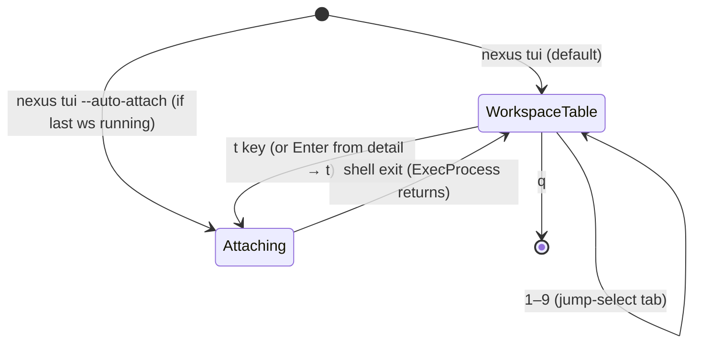

### K.7 Implementation notes

- `tabBarOffset()` returns 1 when `len(tabs) > 0` — used to reduce list height dynamically.
- `updateListSize()` must be called whenever `tabs` changes (in `runShellExec`) and on every `WindowSizeMsg`.
- Tab bar is rendered via `renderTabBar()` in `View()` — inserted between the header status line and the body, with a blank separator line before the body.
- `shellExecCmd(wsID)` is extracted from `runShellExec` so that the auto-attach path in the `workspacesMsg` handler can also call it cleanly.
- `shellReturnedMsg` gains a `wsID string` field so the handler knows which workspace returned.
