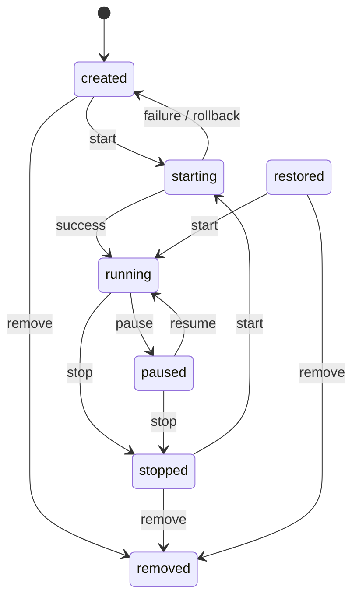

# Nexus System Specification — Chapter 02: State Machines

> **Status**: Normative

---

## Workspace State Machine — `WS-010`–`WS-034`

### State definitions — `WS-010`–`WS-016`

**`WS-010`** — `created`: Workspace record exists. Runtime has not been started. This is the
initial state after `workspace.create` or `workspace.fork`.

**`WS-011`** — `starting`: Workspace start has been initiated and the runtime is booting in the
background. The workspace is not yet ready for connections. Transitions to `running` on success or
`created` on failure/rollback.

**`WS-012`** — `running`: Runtime is active and accepting connections (shell sessions, port
forwards, etc.).

**`WS-013`** — `paused`: Runtime is suspended. Only applicable to VM backends (libkrun). A paused
workspace's memory is preserved but the VM is not consuming CPU.

**`WS-014`** — `stopped`: Runtime has been shut down cleanly. The workspace record persists and
the workspace can be started again.

**`WS-015`** — `restored`: Workspace was restored from a snapshot. Semantically equivalent to
`created` for transition purposes — it can be started or removed.

**`WS-016`** — At any point in time, a workspace MUST be in exactly one of these states:
`created`, `starting`, `running`, `paused`, `stopped`, `restored`, `removed`.

---

### Transition diagram

---

### Legal transitions — `WS-017`–`WS-025`

**`WS-017`** — `created → starting`: Triggered by `workspace.start`. Pre-condition: state is
`created`. Post-condition: state is `starting`.

**`WS-018`** — `starting → running`: Triggered by successful background startup completion.
Pre-condition: state is `starting`. Post-condition: state is `running`.

**`WS-019`** — `starting → created`: Triggered by background startup failure or rollback.
Pre-condition: state is `starting`. Post-condition: state is `created`.

**`WS-020`** — `running → stopped`: Triggered by `workspace.stop`. Pre-condition: state is
`running`. Post-condition: state is `stopped`.

**`WS-021`** — `stopped → starting`: Triggered by `workspace.start`. Pre-condition: state is
`stopped`. Post-condition: state is `starting`.

**`WS-022`** — `created → removed`: Triggered by `workspace.remove`. Pre-condition: state is
`created`. Post-condition: state is `removed`.

**`WS-023`** — `stopped → removed`: Triggered by `workspace.remove`. Pre-condition: state is
`stopped`. Post-condition: state is `removed`.

**`WS-024`** — `restored → running`: Triggered by `workspace.start`. Pre-condition: state is
`restored`. Post-condition: state is `running`.

**`WS-025`** — `restored → removed`: Triggered by `workspace.remove`. Pre-condition: state is
`restored`. Post-condition: state is `removed`.

---

### Illegal transitions — `WS-026`–`WS-029`

**`WS-026`** — Calling `workspace.start` on a workspace already in state `running` or `starting`
MUST return an error (`ERR-011`). The workspace state MUST NOT change.

**`WS-027`** — Calling `workspace.stop` on a workspace NOT in state `running` MUST return an error
(`ERR-012`). The workspace state MUST NOT change.

**`WS-028`** — Calling `workspace.remove` on a workspace in state `running` or `starting` MUST
return an error (`ERR-013`). The workspace state MUST NOT change.

**`WS-029`** — Any state transition not listed in `WS-017`–`WS-025` is illegal and MUST return
`ERR-011`.

---

### Fork lineage — `WS-030`–`WS-034`

**`WS-030`** — `workspace.fork` creates a new workspace by snapshotting the source workspace. The
source workspace MUST be in state `running` when fork is called.

**`WS-031`** — The forked workspace is created in state `created`.

**`WS-032`** — The fork's `parentWorkspaceId` is set to the source workspace's ID.

**`WS-033`** — The fork's `lineageRootId` is set to the source workspace's `lineageRootId` (or
to the source workspace's own ID if the source has no `lineageRootId`, i.e. it is itself a root).

**`WS-034`** — When `childRef` is omitted or empty on `workspace.fork`, the child inherits the
parent's ref. This is not an error.
