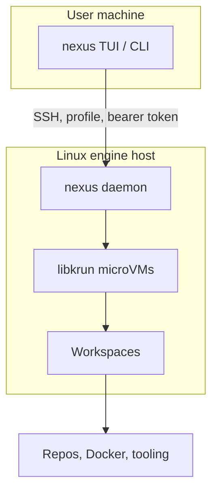

# Nexus Daemon (`packages/nexus`)

Go daemon and interactive **TUI**, plus a **CLI** for scripting and automation, for orchestrating remote workspaces as **lightweight libkrun microVMs** (Linux KVM + guest agent). Day-to-day use is typically `nexus` or `nexus tui`; commands under `nexus <subcommand>` target automation and CI.

## Install (released binaries)

**One-liner** (release assets for Linux and Darwin, amd64/arm64):

```bash
curl -fsSL https://raw.githubusercontent.com/oursky/nexus/main/install.sh | bash
```

This installs the `nexus` binary into `~/.local/bin` (override with `INSTALL_DIR`). The script picks a suitable SHA-256 tool, uses `sudo` only if the install directory is not user-writable. On Linux, the daemon **re-execs the same binary** as an embedded PTY host (`nexus __pty-host`); no separate `pty-host` binary is required.

To pin a version: `curl ... | env NEXUS_VERSION=v0.31.0 bash`, or run from a checkout with `NEXUS_VERSION` set.

**`go install` of the main `nexus` binary is not supported** from the module proxy: Linux builds require embedded guest-agent (and, on amd64, libkrun/passt) blobs staged before `go build`; use the install script or [GitHub Releases](https://github.com/oursky/nexus/releases) assets.

## Flow (conceptual)



## What this package provides

- **Interactive TUI** — primary interface; run `nexus` or `nexus tui`
- **`nexus` CLI** — alternative for scripts, automation, and CI (`nexus daemon`, `nexus workspace`, …)
- **Daemon** — Go server that runs on the remote Linux host, managing workspace lifecycle, port forwards, and PTY sessions
- **4-layer internal architecture** — domain → infra → app → rpc

## Build

```bash
cd packages/nexus
go build ./cmd/nexus/...
```

From the **repository root**, `task build` runs `go build ./...` in this package. Use `task test` and `task ci` for checks; see the root [CONTRIBUTING.md](../../CONTRIBUTING.md) for remote deploy tasks (`dev:remote`, `dev:cli`).

## Test

```bash
cd packages/nexus
go test ./...
```

## CLI command groups


| Group             | Description                                                       |
| ----------------- | ----------------------------------------------------------------- |
| `nexus daemon`    | Connect/disconnect remote daemon, manage daemon process           |
| `nexus workspace` | Full workspace lifecycle (create, start, stop, fork, shell, etc.) |
| `nexus spotlight` | Port-forward management (start, stop, list, per-port controls)    |
| `nexus project`   | Project CRUD                                                      |
| `nexus exec`      | Execute a command in a workspace runtime                          |


## Docs

- Full CLI reference: `[docs/reference/cli.md](../../docs/reference/cli.md)`
- Architecture: `[ARCHITECTURE.md](../../ARCHITECTURE.md)`
